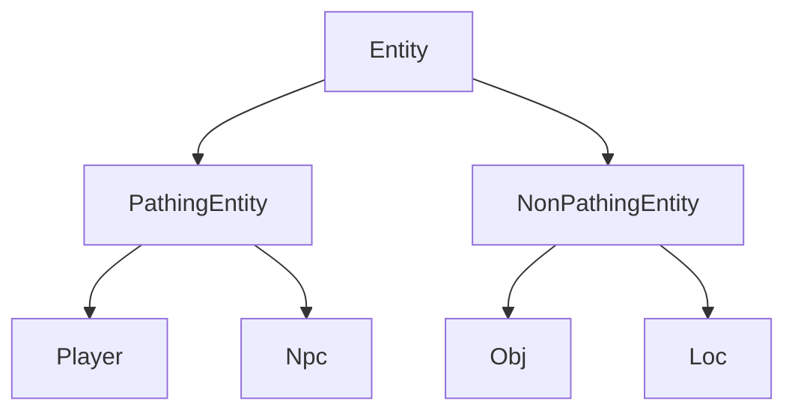

# Core Concepts

Understanding these fundamental concepts is essential for working with the 04Scapes engine effectively.

## Game Loop and Ticks

### Tick-Based Processing

The engine operates on a **tick-based system** where all game logic executes in discrete time intervals:

- **Tick Duration**: 600 milliseconds (0.6 seconds)
- **Tick Rate**: ~1.67 ticks per second
- **Synchronization**: All players experience the same game state at each tick

```typescript
class World {
    private static readonly TICKRATE: number = 600; // 600ms
    
    private async cycle(): Promise<void> {
        const start = Date.now();
        
        // Process all game logic for this tick
        this.processInput();
        this.updateEntities();
        this.executeScripts();
        this.sendUpdates();
        
        const elapsed = Date.now() - start;
        const remaining = World.TICKRATE - elapsed;
        
        // Wait for next tick
        if (remaining > 0) {
            await new Promise(resolve => setTimeout(resolve, remaining));
        }
    }
}
```

### Tick Phases

Each tick is divided into distinct phases:

<Steps>
  <Step title="Input Phase">
    Process all incoming client messages and queue player actions
  </Step>
  
  <Step title="Update Phase">
    Update entity positions, states, and AI behaviors
  </Step>
  
  <Step title="Script Phase">
    Execute queued scripts and process game events
  </Step>
  
  <Step title="Output Phase">
    Generate and send updates to all clients
  </Step>
  
  <Step title="Cleanup Phase">
    Remove expired entities and clean up resources
  </Step>
</Steps>

## Entity System

### Entity Hierarchy

The engine uses an entity-based system to represent all game objects:



### Entity Types

<Tabs>
  <Tab title="Player">
    **Player** (`src/engine/entity/Player.ts`)
    
    Represents a human player character:
    
    ```typescript
    class Player extends PathingEntity {
        // Player-specific data
        username: string;
        appearance: number[];
        skills: number[];
        inventory: Inventory;
        
        // Player state
        rights: number;
        combat: number;
        prayer: boolean;
    }
    ```
    
    **Key Features:**
    - Network connection management
    - Skill and experience tracking  
    - Inventory and equipment
    - Quest progression
    - Social features (friends, ignore)
  </Tab>
  
  <Tab title="NPC">
    **NPC** (`src/engine/entity/Npc.ts`)
    
    Represents non-player characters:
    
    ```typescript
    class Npc extends PathingEntity {
        readonly type: NpcType;
        mode: NpcMode;
        
        // AI state
        huntTarget: PathingEntity | null;
        huntMode: HuntModeType;
        
        // Spawn info
        startX: number;
        startZ: number;
        minX: number;
        maxX: number;
        minZ: number;
        maxZ: number;
    }
    ```
    
    **Key Features:**
    - AI behavior and pathfinding
    - Combat and interaction handling
    - Spawn area management
    - Shop and dialogue systems
  </Tab>
  
  <Tab title="Object">
    **Obj** (`src/engine/entity/Obj.ts`)
    
    Represents ground items and interactive objects:
    
    ```typescript
    class Obj extends NonPathingEntity {
        readonly type: ObjType;
        readonly count: number;
        
        // Ownership and lifecycle
        readonly receiverId: number;
        readonly revealCycle: number;
        readonly despawnCycle: number;
        readonly isPublic: boolean;
    }
    ```
    
    **Key Features:**
    - Item ownership and visibility
    - Automatic despawning
    - Stack management
    - Public/private items
  </Tab>
  
  <Tab title="Location">
    **Loc** (`src/engine/entity/Loc.ts`)
    
    Represents static world objects (doors, furniture, etc.):
    
    ```typescript
    class Loc extends NonPathingEntity {
        readonly type: LocType;
        readonly shape: number;
        readonly angle: number;
        
        // State
        readonly lifecycle: EntityLifeCycle;
        respawnCycle: number;
    }
    ```
    
    **Key Features:**
    - Collision detection
    - Interactive behaviors
    - Respawn mechanics
    - Animation support
  </Tab>
</Tabs>

## Coordinate System

### World Coordinates

The game world uses a coordinate system based on **tiles**:

- **X-Axis**: West-to-East (westernmost = 0)
- **Z-Axis**: South-to-North (southernmost = 0)  
- **Y-Axis**: Vertical levels (ground = 0)
- **Scale**: Each coordinate represents one tile (64 units)

### Coordinate Classes

```typescript
// Absolute world coordinates
class CoordGrid {
    readonly x: number;    // Absolute X coordinate
    readonly z: number;    // Absolute Z coordinate  
    readonly level: number; // Height level (0-3)
    
    // Convert to packed format for storage
    get coord(): number {
        return (this.level << 28) | (this.x << 14) | this.z;
    }
}

// Zone-relative coordinates (8x8 tile zones)
class Zone {
    readonly x: number;    // Zone X (world_x / 8)
    readonly z: number;    // Zone Z (world_z / 8)  
    readonly level: number; // Height level
}
```

### Movement and Pathfinding

```typescript
// Movement system
class PathingEntity extends Entity {
    // Current position
    x: number;
    z: number;
    level: number;
    
    // Movement queue
    walkDir: number = -1;
    runDir: number = -1;
    
    // Pathfinding
    findPath(dest: CoordGrid): number[] {
        return World.gameMap.findPath(
            this.level, this.x, this.z,
            dest.x, dest.z, this.width, this.length
        );
    }
}
```

## Zone System

### Spatial Partitioning

The world is divided into **zones** for efficient processing:

- **Zone Size**: 8x8 tiles (64x64 world units)
- **Purpose**: Limit update scope and improve performance  
- **Active Zones**: Only zones with players are fully simulated

```typescript
class Zone {
    // Zone identification
    readonly x: number;      // Zone coordinate X
    readonly z: number;      // Zone coordinate Z  
    readonly level: number;  // Height level
    
    // Entities in this zone
    players: Set<Player> = new Set();
    npcs: Set<Npc> = new Set();
    objs: Set<Obj> = new Set(); 
    locs: Set<Loc> = new Set();
    
    // Zone state
    shared: boolean = false; // Multiple players present
    updates: ZoneEvent[] = []; // Pending updates
}
```

### Zone Updates

Changes in zones are tracked and sent to relevant players:

```typescript
// Zone update types
enum ZoneEventType {
    OBJ_ADD = 0,
    OBJ_DEL = 1,
    OBJ_COUNT = 2,
    OBJ_REVEAL = 3,
    LOC_ADD_CHANGE = 4,
    LOC_DEL = 5,
    LOC_ANIM = 6,
    MAP_PROJANIM = 7,
    MAP_ANIM = 8,
}

// Example: Add object to zone
zone.writeObjAdd(obj.type, obj.x, obj.z, obj.count);
```

## Inventory System

### Inventory Types

The engine supports multiple inventory types:

<CardGroup cols={2}>
  <Card title="Player Inventories" icon="backpack">
    Personal storage for players (inventory, bank, equipment)
  </Card>
  <Card title="Shared Inventories" icon="store">
    Global inventories like shops with stock management
  </Card>
  <Card title="Temporary Inventories" icon="clock">
    Short-lived containers for trades or interfaces
  </Card>
  <Card title="Component Inventories" icon="window-maximize">
    Interface-bound inventories for specific interactions
  </Card>
</CardGroup>

### Inventory Operations

```typescript
class Inventory {
    readonly capacity: number;
    readonly items: (Item | null)[];
    
    // Core operations
    add(id: number, count: number, slot?: number): boolean;
    remove(id: number, count: number, slot?: number): number;
    hasSpace(id: number, count: number): boolean;
    getItemCount(id: number): number;
    
    // Stack management
    isStackable(id: number): boolean;
    findFreeSlot(): number;
    findItem(id: number): number;
}
```

## Script System

### RuneScript Language

Game content is written in **RuneScript**, a domain-specific language:

```runescript
// Example script
[clientscript,bank_main]
if_setontimer(bank_main_timer, 1, BANK_MAINSCREEN_INTERFACE);
if_openmainmodal(BANK_MAINSCREEN_INTERFACE);

[proc,bank_deposit_item](int $slot, int $count)
if (%inv_getobj(inv, $slot) ! null) {
    inv_moveitem(inv, BANK_INV, $slot, $count);
    sound_synth(deposit_sound, 0, 0);
}
```

### Script Execution

Scripts are compiled to bytecode and executed by the script runner:

```typescript
class ScriptState {
    // Execution context
    readonly script: ScriptFile;
    readonly args: ScriptArgument[];
    
    // Entity references  
    self: Entity | null = null;
    
    // Active entities
    _activePlayer: Player | null = null;
    _activeNpc: Npc | null = null;
    _activeLoc: Loc | null = null;
    _activeObj: Obj | null = null;
    
    // Stack and variables
    intStack: number[] = [];
    stringStack: string[] = [];
    intLocals: number[] = [];
    stringLocals: string[] = [];
}
```

## Network Protocol

### Message Types

The engine uses different message types for client-server communication:

<Tabs>
  <Tab title="Client Messages">
    Messages sent from client to server:
    
    ```typescript
    // Player movement
    class MoveClick implements ClientMessage {
        x: number;
        z: number; 
        ctrlHeld: boolean;
    }
    
    // Object interaction
    class OpLoc implements ClientMessage {
        x: number;
        z: number;
        loc: number;
        mode: number;
    }
    ```
  </Tab>
  
  <Tab title="Server Messages">
    Messages sent from server to client:
    
    ```typescript
    // Player info update
    class PlayerInfo implements ServerMessage {
        players: Player[];
        buildArea: BuildArea;
    }
    
    // Interface update  
    class IfSetText implements ServerMessage {
        component: number;
        text: string;
    }
    ```
  </Tab>
  
  <Tab title="Zone Messages">
    Updates for specific world areas:
    
    ```typescript
    // Object added to zone
    class ObjAdd implements ZoneMessage {
        x: number;
        z: number;
        type: number;
        count: number;
    }
    ```
  </Tab>
</Tabs>

### Protocol Versioning

The engine supports protocol versioning for client compatibility:

```typescript
// RS2 build 244 protocol
class ClientProt244 {
    static readonly MOVE_CLICK = 164;
    static readonly OP_LOC1 = 132;  
    static readonly OP_NPC1 = 155;
    // ... more opcodes
}
```

## Data Types and Configs

### Configuration System

Game data is defined through configuration files:

```typescript
// NPC definition
class NpcType {
    id: number = -1;
    name: string | null = null;
    models: number[] | null = null;
    size: number = 1;
    readyanim: number = -1;
    walkanim: number = -1;
    
    // Combat stats
    level: number = -1;
    hitpoints: number = -1;
    
    // AI behavior
    huntmode: HuntModeType = HuntModeType.OFF;
    huntrange: number = -1;
}
```

### Type Safety

The engine uses TypeScript for compile-time type safety:

```typescript
// Strongly typed config access
const npcType: NpcType = NpcType.get(npcId);
if (npcType.huntmode === HuntModeType.AGGRESSIVE) {
    npc.setHuntTarget(player);
}

// Type-safe inventory operations  
const item: ObjType = ObjType.get(itemId);
if (item.stackable) {
    inventory.add(itemId, count);
}
```

## Error Handling and Logging

### Logging System

Comprehensive logging for debugging and monitoring:

```typescript
import { printInfo, printError, printDebug } from '#/util/Logger.js';

// Different log levels
printInfo('World started successfully');
printError('Failed to load player save');
printDebug(`Player ${player.username} performed action`);
```

### Error Recovery

The engine includes robust error handling:

```typescript
try {
    // Execute potentially failing operation
    player.executeScript(script);
} catch (error) {
    printError(`Script execution failed: ${error.message}`);
    
    // Graceful fallback
    player.messageGame('An error occurred. Please try again.');
    player.clearInteractions();
}
```

## Next Steps

<CardGroup cols={2}>
  <Card title="Project Structure" href="/architecture/project-structure" icon="folder">
    Learn how the codebase is organized
  </Card>
  <Card title="World Engine" href="/architecture/world-engine" icon="globe">
    Deep dive into world simulation
  </Card>
  <Card title="Entity System" href="/engine/entities/overview" icon="users">
    Explore the entity implementations
  </Card>
  <Card title="Script System" href="/scripting/overview" icon="code">
    Learn RuneScript development
  </Card>
</CardGroup>