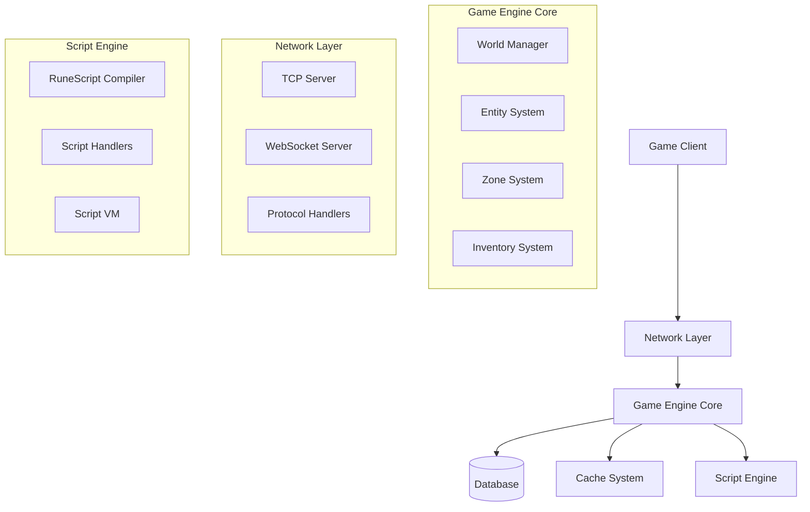
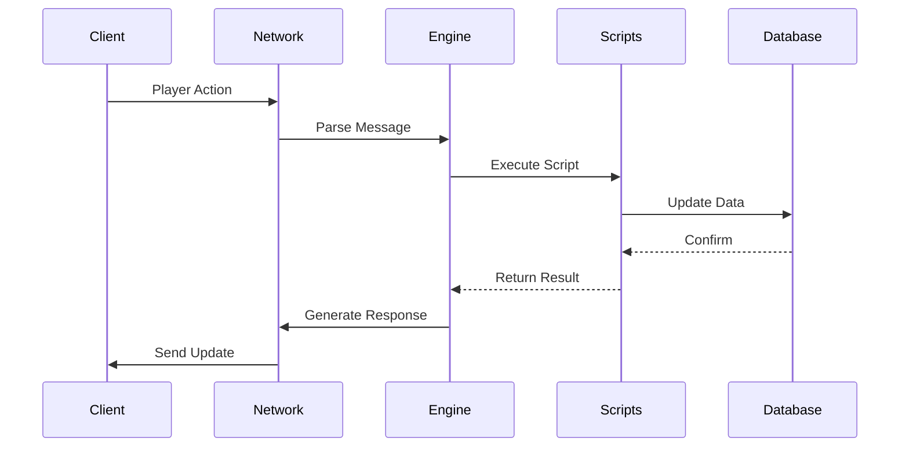
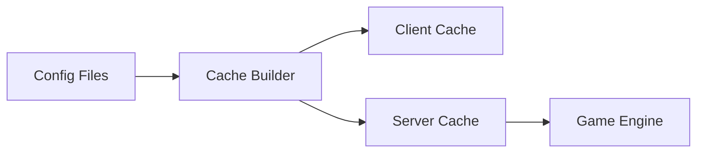
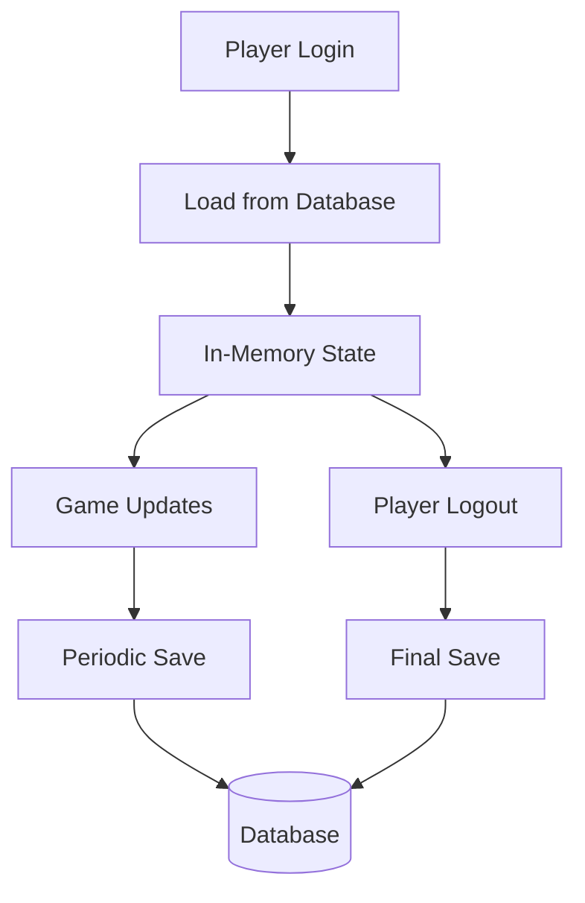

# Architecture Overview

The 04Scapes engine is designed as a high-performance, scalable MMORPG server with a modular architecture that separates concerns and enables maintainable code.

## Core Design Principles

<CardGroup cols={2}>
  <Card title="Tick-Based Processing" icon="clock">
    All game logic operates on a 600ms tick cycle for predictable, synchronized gameplay
  </Card>
  <Card title="Entity-Component System" icon="cubes">
    Entities (players, NPCs, objects) use a component-based architecture for flexibility
  </Card>
  <Card title="Event-Driven Architecture" icon="bolt">
    Systems communicate through events and message queues for loose coupling
  </Card>
  <Card title="Layered Design" icon="layer-group">
    Clear separation between network, engine, database, and scripting layers
  </Card>
</CardGroup>

## System Architecture



## Layer Breakdown

### Network Layer (`/src/network`)

Handles all client-server communication:

- **TCP Server**: Primary game client connections
- **WebSocket Server**: Web client support  
- **Protocol Handlers**: Message encoding/decoding
- **Client Management**: Connection lifecycle and authentication

**Key Files:**
- `src/network/game/client/` - Client message handling
- `src/network/game/server/` - Server message handling
- `src/server/tcp/TcpServer.ts` - TCP connection management

### Game Engine Core (`/src/engine`)

The heart of the game simulation:

- **World Manager**: Global game state and tick processing
- **Entity System**: Players, NPCs, objects, and locations
- **Zone System**: Spatial partitioning and area management
- **Game Logic**: Combat, skills, interactions

**Key Files:**
- `src/engine/World.ts` - Main game loop and world state
- `src/engine/entity/` - Entity implementations
- `src/engine/zone/` - Zone and spatial management

### Script Engine (`/src/engine/script`)

Executes game content and logic:

- **RuneScript Compiler**: Compiles scripts to bytecode
- **Script Runner**: Executes script operations
- **Operation Handlers**: Implementation of script opcodes
- **State Management**: Script execution context

**Key Files:**
- `src/engine/script/ScriptRunner.ts` - Script execution engine
- `src/engine/script/handlers/` - Opcode implementations
- `src/util/RuneScriptCompiler.ts` - Script compilation

### Cache System (`/src/cache`)

Manages game data and assets:

- **Config Loading**: Game object definitions
- **Asset Packing**: Client cache generation
- **Data Validation**: Ensures data integrity
- **Compression**: Optimizes data transfer

**Key Files:**
- `src/cache/config/` - Configuration type definitions
- `src/cache/PackAll.ts` - Cache building and packing
- `tools/pack/` - Build tools for cache generation

### Database Layer (`/src/db`)

Persistent data storage:

- **Account Management**: User accounts and authentication
- **Player Data**: Character saves and progression
- **Social Features**: Friends, ignore lists, messaging
- **Logging**: Activity and security monitoring

**Key Files:**
- `prisma/multiworld/schema.prisma` - Database schema
- `src/db/` - Database access layer

## Component Interactions

### Game Tick Cycle

The engine operates on a fixed 600ms tick cycle:

<Steps>
  <Step title="Input Processing">
    Process incoming client messages and queue player actions
  </Step>
  
  <Step title="Entity Updates">
    Update player positions, NPC AI, and object states
  </Step>
  
  <Step title="Script Execution">
    Run queued scripts and process game events
  </Step>
  
  <Step title="Zone Updates">
    Update spatial data and collision detection
  </Step>
  
  <Step title="Output Generation">
    Generate and send updates to clients
  </Step>
  
  <Step title="Cleanup">
    Remove expired entities and clean up resources
  </Step>
</Steps>

### Message Flow



## Scalability Features

### Multi-World Support

The engine supports multiple game worlds:

- **Shared Database**: Common accounts and friends across worlds
- **World-Specific Data**: Separate player saves per world
- **Cross-World Messaging**: Friends can chat across worlds
- **Load Distribution**: Players distributed across available worlds

### Resource Management

- **Memory Pooling**: Reuse objects to minimize garbage collection
- **Entity Lifecycle**: Efficient creation and cleanup of game entities
- **Zone Loading**: Dynamic loading/unloading of game areas
- **Connection Pooling**: Database connections managed efficiently

### Performance Monitoring

Built-in metrics and monitoring:

```typescript
// Performance tracking
trackCycleTime(startTime);
trackPlayerCount(playerCount);
trackMemoryUsage();
trackDatabaseQueries();
```

## Data Flow Architecture

### Configuration Data



### Player Data



## Security Architecture

### Authentication Flow

<Steps>
  <Step title="Client Connection">
    Client establishes secure connection using RSA encryption
  </Step>
  
  <Step title="Login Request">
    Username/password sent encrypted to login server
  </Step>
  
  <Step title="Credential Verification">
    Database lookup and password hash verification
  </Step>
  
  <Step title="Session Creation">
    Generate session token and player UID
  </Step>
  
  <Step title="World Assignment">
    Transfer player to available game world
  </Step>
</Steps>

### Data Protection

- **Encryption**: All sensitive data encrypted at rest and in transit
- **Input Validation**: All client input validated and sanitized
- **Rate Limiting**: Protection against spam and abuse
- **Audit Logging**: Comprehensive activity logging for security

## Extension Points

The architecture provides several extension points:

### Custom Scripts

```runescript
// Custom game content via RuneScript
[clientscript,custom_feature]
// Implementation here
```

### Event Handlers

```typescript
// Custom event processing
World.addEventHandler('custom_event', (event) => {
    // Handle custom game event
});
```

### Protocol Extensions

```typescript
// Custom client messages
class CustomMessage implements ClientMessage {
    // Implementation
}
```

## Performance Characteristics

### Benchmarks

Typical performance on modern hardware:

- **Players**: 2000+ concurrent players per world
- **NPCs**: 8000+ active NPCs
- **Tick Rate**: Stable 600ms cycles under load
- **Memory**: ~512MB baseline, scales with player count
- **Database**: 1000+ queries/second on standard MySQL

### Optimization Strategies

<AccordionGroup>
  <Accordion title="Memory Optimization">
    - Object pooling for frequently created entities
    - Weak references for cached data
    - Lazy loading of rarely accessed data
    - Memory-mapped files for large datasets
  </Accordion>
  
  <Accordion title="CPU Optimization">  
    - Zone-based processing to reduce iteration costs
    - Efficient collision detection algorithms
    - Compiled RuneScript for fast execution
    - Batched database operations
  </Accordion>
  
  <Accordion title="Network Optimization">
    - Delta compression for position updates
    - Message batching and aggregation
    - Client-side prediction for responsiveness
    - Adaptive quality based on connection
  </Accordion>
</AccordionGroup>

## Next Steps

<CardGroup cols={2}>
  <Card title="Core Concepts" href="/architecture/concepts" icon="lightbulb">
    Learn fundamental engine concepts
  </Card>
  <Card title="Project Structure" href="/architecture/project-structure" icon="folder">
    Understand the codebase organization  
  </Card>
  <Card title="World Engine" href="/architecture/world-engine" icon="globe">
    Deep dive into the world simulation
  </Card>
  <Card title="Game Loop" href="/architecture/game-loop" icon="refresh">
    Understanding the tick-based processing
  </Card>
</CardGroup>