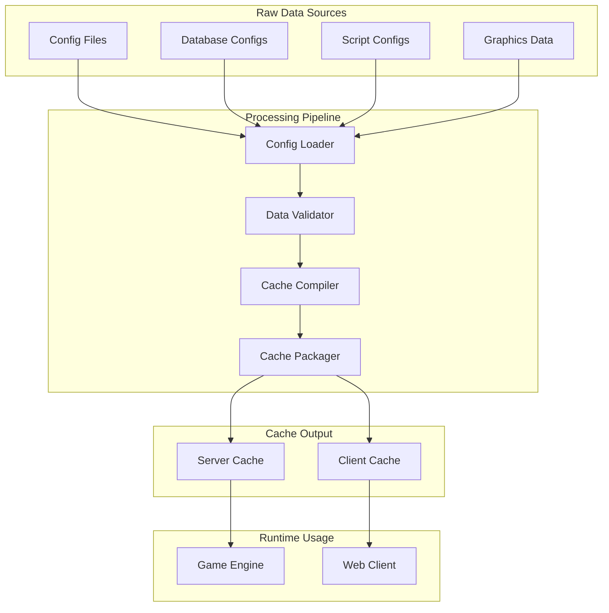

# Configuration Overview

The 04Scapes engine uses a sophisticated configuration and caching system to manage all game data including NPCs, items, locations, animations, and interfaces. The system compiles raw configuration data into optimized cache files for both client and server use.

## Configuration Architecture



## Configuration Types

The engine supports numerous configuration types for different game elements:

<Tabs>
  <Tab title="Object Configs">
    **ObjType** - Items and objects that can be held or placed
    
    ```typescript
    // src/cache/config/ObjType.ts
    class ObjType extends ConfigType {
        id: number = -1;
        name: string | null = null;
        description: string | null = null;
        
        // 3D model and graphics
        model: number = -1;
        zoom2d: number = 2000;
        xan2d: number = 0;
        yan2d: number = 0;
        zan2d: 0;
        
        // Interface appearance
        xof2d: number = 0;
        yof2d: number = 0;
        stackable: boolean = false;
        
        // Value and properties
        cost: number = 1;
        members: boolean = false;
        tradeable: boolean = false;
        
        // Wearable equipment
        wearpos: number = -1;
        wearpos2: number = -1;
        wearpos3: number = -1;
        
        // Color customization
        recol_s: number[] | null = null;
        recol_d: number[] | null = null;
        
        // Interaction options
        op: (string | null)[] = new Array(5).fill(null);
        iop: (string | null)[] = new Array(5).fill(null);
        
        static load(id: number): ObjType {
            // Load from cache or create default
            return this.configs.get(id) || this.createDefault(id);
        }
    }
    ```
    
    **Key Features:**
    - Item appearance and 3D models
    - Stackability and trading rules
    - Equipment slot assignments
    - Color recoloring support
    - Context menu options
  </Tab>
  
  <Tab title="NPC Configs">
    **NpcType** - Non-player character definitions
    
    ```typescript
    // src/cache/config/NpcType.ts
    class NpcType extends ConfigType {
        id: number = -1;
        name: string | null = null;
        description: string | null = null;
        
        // 3D models and appearance
        models: number[] | null = null;
        heads: number[] | null = null;
        size: number = 1;
        
        // Animations
        readyanim: number = -1;
        walkanim: number = -1;
        walkanimbk: number = -1;
        walkaniml: number = -1;
        walkanimr: number = -1;
        
        // Combat properties
        level: number = -1;
        hitpoints: number = -1;
        stats: number[] | null = null;
        
        // AI behavior
        huntmode: HuntModeType = HuntModeType.OFF;
        huntrange: number = 10;
        defaultmode: NpcMode = NpcMode.WANDER;
        
        // Interaction
        op: (string | null)[] = new Array(5).fill(null);
        blockwalk: boolean = true;
        
        // Visual properties
        resizeh: number = 128;
        resizev: number = 128;
        recol_s: number[] | null = null;
        recol_d: number[] | null = null;
        
        // Special flags
        minimap: boolean = true;
        vislevel: number = -1;
        active: boolean = true;
        members: boolean = false;
    }
    ```
    
    **Key Features:**
    - 3D model and animation assignments
    - Combat statistics and AI behavior
    - Interaction options and collision
    - Visual customization options
    - Movement and pathfinding settings
  </Tab>
  
  <Tab title="Location Configs">
    **LocType** - World objects and scenery
    
    ```typescript
    // src/cache/config/LocType.ts
    class LocType extends ConfigType {
        id: number = -1;
        name: string | null = null;
        
        // 3D models for different orientations
        models: number[] | null = null;
        shapes: number[] | null = null;
        
        // Collision and pathfinding
        blockwalk: boolean = true;
        blockrange: boolean = true;
        
        // Interaction
        op: (string | null)[] = new Array(5).fill(null);
        active: boolean = true;
        
        // Animation
        anim: number = -1;
        
        // Visual properties
        width: number = 1;
        length: number = 1;
        hillskew: boolean = true;
        sharelight: boolean = true;
        
        // Color and texture
        recol_s: number[] | null = null;
        recol_d: number[] | null = null;
        retex_s: number[] | null = null;
        retex_d: number[] | null = null;
        
        // Special properties
        mirror: boolean = false;
        shadow: boolean = true;
        mapfunction: number = -1;
        members: boolean = false;
    }
    ```
  </Tab>
  
  <Tab title="Animation Configs">
    **SeqType** - Animation sequences
    
    ```typescript
    // src/cache/config/SeqType.ts
    class SeqType extends ConfigType {
        id: number = -1;
        
        // Animation frames
        frames: number[] | null = null;
        iframes: number[] | null = null;
        delays: number[] | null = null;
        
        // Animation properties
        replayoff: number = -1;
        walkmerge: number[] | null = null;
        
        // Priority and layering
        priority: number = 5;
        lefthand: number = -1;
        righthand: number = -1;
        
        // Replay behavior
        replaycount: number = 99;
    }
    ```
  </Tab>
</Tabs>

## Cache Building Process

The cache building process converts raw configuration data into optimized formats:

<Steps>
  <Step title="Data Collection">
    Gather configuration data from various sources
    
    ```typescript
    // tools/pack/pack.ts
    async function packServer(modelFlags: number[]): Promise<void> {
        printInfo('Packing server cache...');
        
        // Load all configuration types
        await loadConfigs();
        
        // Process each config type
        await packNpcConfigs();
        await packObjConfigs();
        await packLocConfigs();
        await packSeqConfigs();
        // ... other config types
        
        printInfo('Server cache packed successfully');
    }
    ```
  </Step>
  
  <Step title="Validation">
    Validate configuration data for consistency
    
    ```typescript
    function validateNpcConfig(config: NpcType): boolean {
        // Check required fields
        if (config.name === null) {
            printError(`NPC ${config.id} has no name`);
            return false;
        }
        
        // Validate model references
        if (config.models) {
            for (const modelId of config.models) {
                if (!ModelType.has(modelId)) {
                    printWarning(`NPC ${config.id} references missing model ${modelId}`);
                }
            }
        }
        
        // Validate animation references
        if (config.readyanim !== -1 && !SeqType.has(config.readyanim)) {
            printWarning(`NPC ${config.id} references missing animation ${config.readyanim}`);
        }
        
        return true;
    }
    ```
  </Step>
  
  <Step title="Compilation">
    Compile configurations into binary format
    
    ```typescript
    function compileNpcConfig(config: NpcType): Uint8Array {
        const packet = new Packet();
        
        // Write config data in binary format
        packet.p2(config.id);
        
        if (config.name !== null) {
            packet.p1(1); // Has name
            packet.pjstr(config.name);
        } else {
            packet.p1(0); // No name
        }
        
        // Models
        if (config.models !== null) {
            packet.p1(config.models.length);
            for (const model of config.models) {
                packet.p2(model);
            }
        } else {
            packet.p1(0);
        }
        
        // Continue for all properties...
        
        return packet.data.slice(0, packet.pos);
    }
    ```
  </Step>
  
  <Step title="Packaging">
    Package compiled data into cache files
    
    ```typescript
    async function packageServerCache(): Promise<void> {
        const cacheData = new Map<string, Uint8Array>();
        
        // Package all config types
        cacheData.set('npc.dat', await packageNpcConfigs());
        cacheData.set('obj.dat', await packageObjConfigs());
        cacheData.set('loc.dat', await packageLocConfigs());
        cacheData.set('seq.dat', await packageSeqConfigs());
        
        // Write cache files
        for (const [filename, data] of cacheData) {
            await fs.writeFile(`data/pack/server/${filename}`, data);
        }
    }
    ```
  </Step>
</Steps>

## Client Cache Generation

The engine generates client-compatible cache files:

<Tabs>
  <Tab title="Cache Structure">
    ```typescript
    // Client cache file structure
    interface ClientCache {
        // Main data archives
        main_file_cache: Archive;
        
        // Individual archives
        models: Archive;        // 3D models
        animations: Archive;    // Animation data
        textures: Archive;      // Texture data
        sounds: Archive;        // Audio files
        maps: Archive;          // Map data
        
        // Configuration archives
        configs: Archive;       // Object/NPC/etc configs
        interfaces: Archive;    // UI definitions
        scripts: Archive;       // Client scripts
    }
    
    class Archive {
        files: Map<number, Uint8Array> = new Map();
        indices: number[] = [];
        
        addFile(id: number, data: Uint8Array): void {
            this.files.set(id, data);
            this.indices.push(id);
        }
        
        pack(): Uint8Array {
            // Pack archive in RuneScape format
            const packed = new Packet();
            
            // Write file count
            packed.p2(this.files.size);
            
            // Write file data
            for (const [id, data] of this.files) {
                packed.p2(id);
                packed.p4(data.length);
                packed.pdata(data, data.length);
            }
            
            return packed.data.slice(0, packed.pos);
        }
    }
    ```
  </Tab>
  
  <Tab title="Model Processing">
    ```typescript
    // 3D model processing for client
    class ModelProcessor {
        static async processModel(modelId: number): Promise<Uint8Array> {
            const modelData = await loadRawModel(modelId);
            
            // Convert to client format
            const packet = new Packet();
            
            // Vertex data
            packet.p2(modelData.vertices.length);
            for (const vertex of modelData.vertices) {
                packet.p2(vertex.x);
                packet.p2(vertex.y);
                packet.p2(vertex.z);
            }
            
            // Face data
            packet.p2(modelData.faces.length);
            for (const face of modelData.faces) {
                packet.p2(face.a);
                packet.p2(face.b);
                packet.p2(face.c);
            }
            
            // Texture coordinates
            if (modelData.textureCoords) {
                packet.p1(1); // Has texture coords
                for (const coord of modelData.textureCoords) {
                    packet.p2(coord.u);
                    packet.p2(coord.v);
                }
            } else {
                packet.p1(0); // No texture coords
            }
            
            return packet.data.slice(0, packet.pos);
        }
    }
    ```
  </Tab>
  
  <Tab title="Interface Processing">
    ```typescript
    // Interface processing for client
    class InterfaceProcessor {
        static async processInterface(interfaceId: number): Promise<Uint8Array> {
            const component = Component.get(interfaceId);
            const packet = new Packet();
            
            // Component type and properties
            packet.p1(component.type);
            packet.p1(component.contentType);
            packet.p2(component.x);
            packet.p2(component.y);
            packet.p2(component.width);
            packet.p2(component.height);
            
            // Interaction properties
            packet.p1(component.hidden ? 1 : 0);
            packet.p1(component.layer);
            
            // Content-specific data
            switch (component.type) {
                case ComponentType.RECTANGLE:
                    packet.p4(component.color || 0);
                    packet.p1(component.fill ? 1 : 0);
                    break;
                    
                case ComponentType.TEXT:
                    packet.pjstr(component.text || '');
                    packet.p2(component.font || 0);
                    packet.p4(component.color || 0);
                    packet.p1(component.centre ? 1 : 0);
                    break;
                    
                case ComponentType.MODEL:
                    packet.p2(component.model || -1);
                    packet.p2(component.anim || -1);
                    break;
            }
            
            return packet.data.slice(0, packet.pos);
        }
    }
    ```
  </Tab>
</Tabs>

## Configuration Loading System

Runtime configuration loading optimized for performance:

```typescript
// src/cache/config/ConfigType.ts
abstract class ConfigType {
    protected static configs: Map<number, ConfigType> = new Map();
    protected static loaded: boolean = false;
    
    // Load all configurations of this type
    static async loadAll(): Promise<void> {
        if (this.loaded) return;
        
        const cacheFile = `data/pack/server/${this.getCacheFilename()}`;
        const data = await fs.readFile(cacheFile);
        const packet = new Packet(data);
        
        // Read configuration count
        const count = packet.g2();
        
        for (let i = 0; i < count; i++) {
            const config = this.createInstance();
            config.decode(packet);
            this.configs.set(config.id, config);
        }
        
        this.loaded = true;
        printInfo(`Loaded ${count} ${this.name} configurations`);
    }
    
    // Get configuration by ID
    static get(id: number): ConfigType | null {
        if (!this.loaded) {
            throw new Error(`${this.name} configurations not loaded`);
        }
        
        return this.configs.get(id) || null;
    }
    
    // Check if configuration exists
    static has(id: number): boolean {
        return this.configs.has(id);
    }
    
    // Decode configuration from binary data
    abstract decode(packet: Packet): void;
    
    // Get cache filename for this config type
    protected static getCacheFilename(): string {
        return `${this.name.toLowerCase()}.dat`;
    }
    
    // Create new instance of this config type
    protected static createInstance(): ConfigType {
        throw new Error('Must implement createInstance');
    }
}

// Example implementation for ObjType
class ObjType extends ConfigType {
    // ... properties ...
    
    decode(packet: Packet): void {
        this.id = packet.g2();
        
        while (true) {
            const opcode = packet.g1();
            if (opcode === 0) break;
            
            switch (opcode) {
                case 1: // Name
                    this.name = packet.gjstr();
                    break;
                    
                case 2: // Description
                    this.description = packet.gjstr();
                    break;
                    
                case 5: // Model
                    this.model = packet.g2();
                    break;
                    
                case 11: // Stackable
                    this.stackable = true;
                    break;
                    
                case 12: // Cost
                    this.cost = packet.g4();
                    break;
                    
                case 16: // Members
                    this.members = true;
                    break;
                    
                // ... handle other opcodes ...
                
                default:
                    throw new Error(`Unknown ObjType opcode: ${opcode}`);
            }
        }
    }
    
    protected static createInstance(): ObjType {
        return new ObjType();
    }
}
```

## Cache Validation and Integrity

The system includes comprehensive validation:

<Tabs>
  <Tab title="Reference Validation">
    ```typescript
    class CacheValidator {
        static async validateReferences(): Promise<void> {
            printInfo('Validating cache references...');
            
            const errors: string[] = [];
            
            // Validate NPC model references
            for (const npc of NpcType.getAll()) {
                if (npc.models) {
                    for (const modelId of npc.models) {
                        if (!ModelType.has(modelId)) {
                            errors.push(`NPC ${npc.id} references missing model ${modelId}`);
                        }
                    }
                }
                
                if (npc.readyanim !== -1 && !SeqType.has(npc.readyanim)) {
                    errors.push(`NPC ${npc.id} references missing animation ${npc.readyanim}`);
                }
            }
            
            // Validate object model references
            for (const obj of ObjType.getAll()) {
                if (obj.model !== -1 && !ModelType.has(obj.model)) {
                    errors.push(`Object ${obj.id} references missing model ${obj.model}`);
                }
            }
            
            // Report errors
            if (errors.length > 0) {
                printError(`Found ${errors.length} reference errors:`);
                errors.forEach(error => printError(`  ${error}`));
            } else {
                printInfo('All references validated successfully');
            }
        }
    }
    ```
  </Tab>
  
  <Tab title="Checksum Verification">
    ```typescript
    class ChecksumVerifier {
        static async verifyCache(): Promise<boolean> {
            const expectedChecksums = await this.loadExpectedChecksums();
            const actualChecksums = await this.calculateActualChecksums();
            
            let allValid = true;
            
            for (const [filename, expectedCrc] of expectedChecksums) {
                const actualCrc = actualChecksums.get(filename);
                
                if (actualCrc !== expectedCrc) {
                    printError(`Checksum mismatch for ${filename}: expected ${expectedCrc}, got ${actualCrc}`);
                    allValid = false;
                } else {
                    printInfo(`Checksum verified for ${filename}`);
                }
            }
            
            return allValid;
        }
        
        private static async calculateActualChecksums(): Promise<Map<string, number>> {
            const checksums = new Map<string, number>();
            const cacheDir = 'data/pack/server';
            
            const files = await fs.readdir(cacheDir);
            
            for (const filename of files) {
                const filepath = path.join(cacheDir, filename);
                const data = await fs.readFile(filepath);
                const crc = CrcTable.calculate(data);
                checksums.set(filename, crc);
            }
            
            return checksums;
        }
    }
    ```
  </Tab>
</Tabs>

## Performance Optimization

The configuration system includes several performance optimizations:

<AccordionGroup>
  <Accordion title="Lazy Loading">
    ```typescript
    class LazyConfigLoader<T extends ConfigType> {
        private loaded = new Set<number>();
        private cache = new Map<number, T>();
        
        get(id: number): T | null {
            // Return cached instance if available
            if (this.cache.has(id)) {
                return this.cache.get(id)!;
            }
            
            // Skip if we know it doesn't exist
            if (this.loaded.has(id)) {
                return null;
            }
            
            // Try to load from disk
            const config = this.loadFromDisk(id);
            if (config) {
                this.cache.set(id, config);
            }
            
            this.loaded.add(id);
            return config;
        }
        
        private loadFromDisk(id: number): T | null {
            // Load individual config from index file
            const indexFile = `data/pack/server/${this.getConfigName()}.idx`;
            const dataFile = `data/pack/server/${this.getConfigName()}.dat`;
            
            // Read index to find config offset
            const index = this.readIndex(indexFile, id);
            if (!index) return null;
            
            // Read config data from offset
            const data = this.readConfigData(dataFile, index.offset, index.length);
            
            // Decode and return config
            const config = this.createInstance();
            config.decode(new Packet(data));
            return config;
        }
    }
    ```
  </Accordion>
  
  <Accordion title="Memory Management">
    ```typescript
    class ConfigMemoryManager {
        private static readonly MAX_CACHE_SIZE = 10000;
        private static lruCache = new Map<string, ConfigType>();
        private static accessOrder = new Map<string, number>();
        private static accessCounter = 0;
        
        static get<T extends ConfigType>(type: string, id: number): T | null {
            const key = `${type}:${id}`;
            
            // Update access tracking
            this.accessOrder.set(key, ++this.accessCounter);
            
            // Return from cache if available
            if (this.lruCache.has(key)) {
                return this.lruCache.get(key) as T;
            }
            
            // Load from storage
            const config = this.loadConfig<T>(type, id);
            if (!config) return null;
            
            // Add to cache
            this.lruCache.set(key, config);
            
            // Evict oldest entries if cache is full
            this.evictOldest();
            
            return config;
        }
        
        private static evictOldest(): void {
            if (this.lruCache.size <= this.MAX_CACHE_SIZE) return;
            
            // Find oldest access
            let oldestKey = '';
            let oldestAccess = Number.MAX_VALUE;
            
            for (const [key, access] of this.accessOrder) {
                if (access < oldestAccess) {
                    oldestAccess = access;
                    oldestKey = key;
                }
            }
            
            // Remove oldest entry
            if (oldestKey) {
                this.lruCache.delete(oldestKey);
                this.accessOrder.delete(oldestKey);
            }
        }
    }
    ```
  </Accordion>
</AccordionGroup>

## Development Tools

The system includes tools for configuration development:

<Tabs>
  <Tab title="Config Editor">
    ```typescript
    // Development tool for editing configurations
    class ConfigEditor {
        static async editNpc(id: number): Promise<void> {
            const npc = NpcType.get(id);
            if (!npc) {
                console.log(`NPC ${id} not found`);
                return;
            }
            
            console.log(`Editing NPC ${id}: ${npc.name}`);
            console.log(`Current level: ${npc.level}`);
            console.log(`Current hitpoints: ${npc.hitpoints}`);
            
            // Interactive editing interface
            const newLevel = await this.prompt('Enter new level: ');
            if (newLevel) {
                npc.level = parseInt(newLevel);
            }
            
            // Save changes
            await this.saveNpc(npc);
            console.log('NPC saved successfully');
        }
        
        private static async saveNpc(npc: NpcType): Promise<void> {
            // Encode NPC to binary format
            const data = this.encodeNpc(npc);
            
            // Update cache file
            const cacheFile = 'data/pack/server/npc.dat';
            await this.updateCacheEntry(cacheFile, npc.id, data);
        }
    }
    ```
  </Tab>
  
  <Tab title="Cache Inspector">
    ```typescript
    // Tool for inspecting cache contents
    class CacheInspector {
        static async inspectConfig(type: string, id: number): Promise<void> {
            let config: ConfigType | null = null;
            
            switch (type.toLowerCase()) {
                case 'npc':
                    config = NpcType.get(id);
                    break;
                case 'obj':
                    config = ObjType.get(id);
                    break;
                case 'loc':
                    config = LocType.get(id);
                    break;
            }
            
            if (!config) {
                console.log(`${type} ${id} not found`);
                return;
            }
            
            // Display config properties
            console.log(`=== ${type.toUpperCase()} ${id} ===`);
            for (const [key, value] of Object.entries(config)) {
                if (value !== null && value !== undefined) {
                    console.log(`${key}: ${JSON.stringify(value)}`);
                }
            }
        }
        
        static async listConfigs(type: string, filter?: string): Promise<void> {
            const configs = this.getConfigsOfType(type);
            
            console.log(`=== ${type.toUpperCase()} CONFIGS ===`);
            
            for (const config of configs) {
                if (filter && !config.name?.toLowerCase().includes(filter.toLowerCase())) {
                    continue;
                }
                
                console.log(`${config.id}: ${config.name || 'Unnamed'}`);
            }
        }
    }
    ```
  </Tab>
</Tabs>

## Cache Deployment

For production deployments, the cache system supports automated building and deployment:

```typescript
// Automated cache deployment
class CacheDeployment {
    static async deploy(): Promise<void> {
        printInfo('Starting cache deployment...');
        
        try {
            // Build cache files
            await this.buildCache();
            
            // Validate cache integrity
            await this.validateCache();
            
            // Deploy to production servers
            await this.deployToServers();
            
            printInfo('Cache deployment completed successfully');
            
        } catch (error) {
            printError(`Cache deployment failed: ${error.message}`);
            throw error;
        }
    }
    
    private static async buildCache(): Promise<void> {
        // Clean old cache
        await this.cleanCache();
        
        // Build server cache
        const modelFlags: number[] = [];
        await packServer(modelFlags);
        
        // Build client cache
        await packClient(modelFlags);
    }
    
    private static async deployToServers(): Promise<void> {
        const servers = Environment.DEPLOYMENT_SERVERS.split(',');
        
        for (const server of servers) {
            printInfo(`Deploying cache to ${server}...`);
            
            // Upload cache files via SCP or similar
            await this.uploadCache(server);
            
            // Restart server to load new cache
            await this.restartServer(server);
        }
    }
}
```

## Next Steps

<CardGroup cols={2}>
  <Card title="NPC Config" href="/config/npc-config" icon="robot">
    Learn about NPC configuration options
  </Card>
  <Card title="Object Config" href="/config/object-config" icon="cube">
    Explore item and object configuration
  </Card>
  <Card title="Cache Packing" href="/config/cache-packing" icon="box">
    Understand the cache building process
  </Card>
  <Card title="Location Config" href="/config/location-config" icon="map-marker-alt">
    Configure world objects and scenery
  </Card>
</CardGroup>