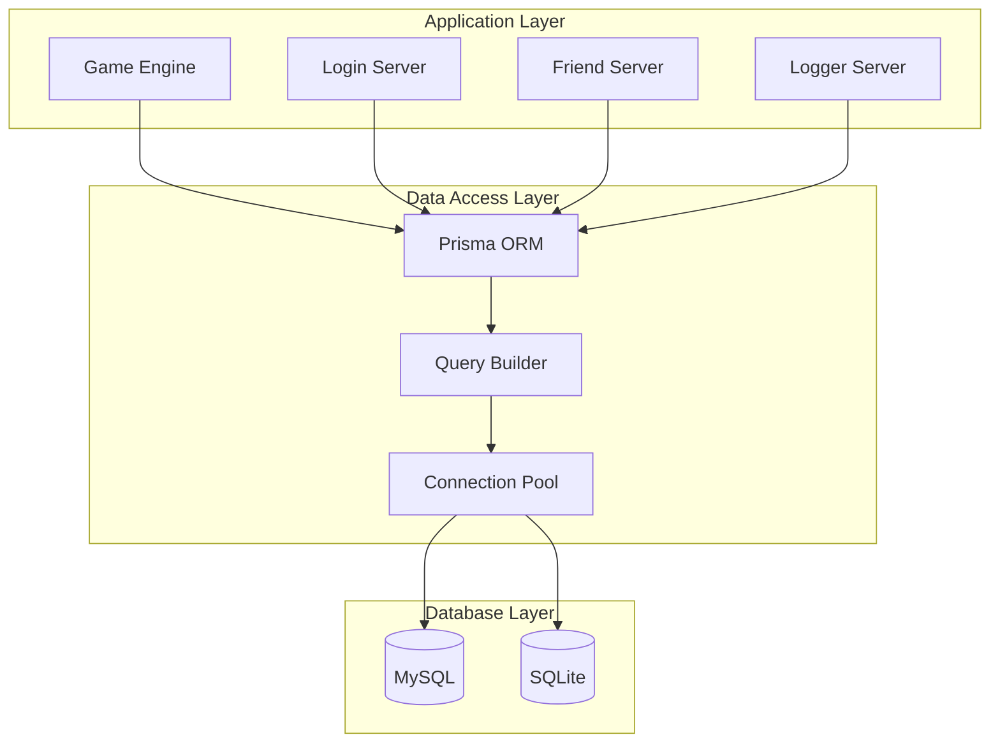

# Database Overview

The 04Scapes engine uses a robust database system for persistent data storage, supporting both MySQL and SQLite databases through Prisma ORM. The database handles account management, player saves, social features, logging, and administrative functions.

## Database Architecture



## Schema Types

The engine supports two database schemas optimized for different deployment scenarios:

<Tabs>
  <Tab title="Multi-world Schema">
    **Production schema supporting multiple game worlds**
    
    ```prisma
    // prisma/multiworld/schema.prisma
    datasource db {
        provider = "mysql"
        url      = env("DATABASE_URL")
    }
    
    model account {
        id                Int       @id @default(autoincrement())
        username          String    @unique
        password          String
        registration_date DateTime  @default(now())
        members           Boolean   @default(false)
        staffmodlevel     Int       @default(0)
        
        // Security features
        tfa_enabled       Boolean   @default(false)
        tfa_secret_base32 String?
        banned_until      DateTime?
        muted_until       DateTime?
    }
    ```
    
    **Features:**
    - Cross-world account management
    - Centralized friends and messaging
    - World-specific player data
    - Comprehensive audit logging
    - Advanced security features
    
    **Use Cases:**
    - Production deployments
    - Multiple game worlds
    - Large player bases
    - Commercial servers
  </Tab>
  
  <Tab title="Single-world Schema">
    **Simplified schema for development and single-world deployments**
    
    ```prisma
    // prisma/singleworld/schema.prisma
    datasource db {
        provider = "sqlite"
        url      = "file:./data/game.db"
    }
    
    model account {
        id                Int       @id @default(autoincrement())
        username          String    @unique
        password          String
        registration_date DateTime  @default(now())
        members           Boolean   @default(false)
    }
    ```
    
    **Features:**
    - Simplified structure
    - SQLite compatibility
    - Fast development setup
    - Local storage
    
    **Use Cases:**
    - Development environments
    - Single-world servers
    - Testing and prototyping
    - Local deployments
  </Tab>
</Tabs>

## Core Database Models

### Account Management

The account system handles user authentication and basic information:

<Tabs>
  <Tab title="Account Model">
    ```prisma
    model account {
        id                     Int       @id @default(autoincrement())
        
        // Basic information
        username               String    @unique
        password               String    // Bcrypt hashed
        password_updated       DateTime?
        email                  String?
        oauth_provider         String?   // For third-party auth
        
        // Registration tracking
        registration_ip        String?
        registration_date      DateTime  @default(now())
        
        // Account status
        muted_until           DateTime?
        banned_until          DateTime?
        staffmodlevel         Int       @default(0)
        members               Boolean   @default(false)
        
        // Administrative notes
        notes                 String?   @db.Text
        notes_updated         DateTime?
        
        // Two-factor authentication
        tfa_enabled           Boolean   @default(false)
        tfa_last_code         Int       @default(0)
        tfa_secret_base32     String?
        tfa_incorrect_attempts Int      @default(0)
    }
    ```
    
    **Key Features:**
    - Secure password hashing with bcrypt
    - Two-factor authentication support
    - Account status tracking (bans, mutes)
    - Staff permission levels
    - Member account support
    - Administrative notes system
  </Tab>
  
  <Tab title="Session Management">
    ```prisma
    // Active login status
    model account_login {
        account_id  Int
        profile     String
        
        // Current session
        logged_in   Int       @default(0)  // World ID or 0 if offline
        login_time  DateTime?
        
        // Last session
        logged_out  Int       @default(0)
        logout_time DateTime?
        
        @@unique([account_id, profile])
    }
    
    // Session tracking
    model session {
        uuid       String   @id
        account_id Int
        profile    String
        world      Int
        timestamp  DateTime
        uid        Int      // Player UID in world
        ip         String?
    }
    ```
    
    **Session Features:**
    - Multi-profile support (main, ironman, etc.)
    - World assignment tracking  
    - Login/logout timestamps
    - IP address logging
    - Unique session identifiers
  </Tab>
  
  <Tab title="Security Models">
    ```prisma
    // Login attempt monitoring
    model login {
        uuid       String   @id
        account_id Int
        world      Int
        timestamp  DateTime
        uid        Int
        ip         String?
    }
    
    // IP banning system
    model ipban {
        ip String @id
    }
    
    // Activity logging
    model account_session {
        id           Int      @id @default(autoincrement())
        account_id   Int
        world        Int      @default(0)
        profile      String   @default("main")
        session_uuid String
        timestamp    DateTime
        coord        Int      // Player location
        event        String   // Event description
        event_type   Int      @default(-1)
    }
    ```
  </Tab>
</Tabs>

### Social Features

The database supports comprehensive social features:

<Tabs>
  <Tab title="Friends System">
    ```prisma
    model friendlist {
        account_id        Int
        profile           String   @default("main")
        friend_account_id Int
        created           DateTime @default(now())
        
        @@id([account_id, profile, friend_account_id])
    }
    
    model ignorelist {
        account_id Int
        profile    String   @default("main")
        value      String   // Username to ignore
        created    DateTime @default(now())
        
        @@id([account_id, profile, value])
    }
    ```
    
    **Friend System Features:**
    - Per-profile friend lists
    - Ignore list functionality
    - Creation timestamps
    - Cross-world friend status
  </Tab>
  
  <Tab title="Chat and Messaging">
    ```prisma
    model public_chat {
        id         Int      @id @default(autoincrement())
        account_id Int
        profile    String
        world      Int
        timestamp  DateTime
        coord      Int      // Location where message was sent
        message    String
    }
    
    model private_chat {
        id            Int      @id @default(autoincrement())
        account_id    Int
        profile       String
        timestamp     DateTime
        coord         Int
        to_account_id Int      // Recipient
        message       String
    }
    ```
    
    **Chat Features:**
    - Public chat logging
    - Private message history
    - Location tracking
    - Cross-profile messaging
  </Tab>
  
  <Tab title="Message Centre">
    ```prisma
    model message_thread {
        id                Int      @id @default(autoincrement())
        to_account_id     Int?
        from_account_id   Int
        last_message_from Int
        subject           String
        created           DateTime @default(now())
        updated           DateTime @default(now())
        messages          Int      @default(1)
        closed            DateTime?
        closed_by         Int?
        marked_spam       DateTime?
        marked_spam_by    Int?
    }
    
    model message {
        id         Int      @id @default(autoincrement())
        thread_id  Int
        sender_id  Int
        sender_ip  String
        content    String   @db.Text
        created    DateTime @default(now())
        edited     DateTime?
        edited_by  Int?
        deleted    DateTime?
        deleted_by Int?
    }
    ```
    
    **Message Centre Features:**
    - Threaded conversations
    - Message editing and deletion
    - Spam marking system
    - Administrative oversight
  </Tab>
</Tabs>

### Hiscores and Statistics

Player achievements and statistics are tracked comprehensively:

<Tabs>
  <Tab title="Hiscore System">
    ```prisma
    model hiscore {
        account_id Int
        profile    String   @default("main")
        type       Int      // Skill ID
        level      Int
        value      Int      // Experience points
        date       DateTime @default(now()) @updatedAt
        
        @@id([account_id, profile, type])
    }
    
    // For large values (total XP, etc.)
    model hiscore_large {
        account_id Int
        profile    String   @default("main")
        type       Int
        level      Int
        value      BigInt   // 64-bit integer for large values
        date       DateTime @default(now()) @updatedAt
        
        @@id([account_id, profile, type])
    }
    ```
    
    **Hiscore Features:**
    - Per-skill level and experience tracking
    - Profile-specific hiscores (main, ironman, etc.)
    - Support for large experience values
    - Automatic timestamp updates
    - Compound primary keys for efficiency
  </Tab>
  
  <Tab title="Wealth Tracking">
    ```prisma
    model wealth_event {
        id                  Int      @id @default(autoincrement())
        timestamp           DateTime
        coord               Int      // Location of event
        world               Int      @default(0)
        profile             String   @default("main")
        event_type          Int      @default(-1)
        
        // Primary account (giver/loser)
        account_id          Int
        account_session     String
        account_items       String   @db.MediumText // JSON item data
        account_value       Int
        
        // Secondary account (receiver/beneficiary)
        recipient_id        Int?
        recipient_session   String?
        recipient_items     String?  @db.MediumText
        recipient_value     Int?
        
        @@index([recipient_id])
    }
    ```
    
    **Wealth Tracking Features:**
    - Complete transaction logging
    - Item value calculations
    - Dual-party transaction support
    - Location and timestamp tracking
    - Session correlation
  </Tab>
</Tabs>

### Administrative Features

<Tabs>
  <Tab title="Player Reports">
    ```prisma
    model report {
        id         Int      @id @default(autoincrement())
        account_id Int      // Reporter
        profile    String
        world      Int
        timestamp  DateTime
        coord      Int      // Location of incident
        offender   String   // Reported player
        reason     Int      // Report reason code
        reviewed   Boolean  @default(false)
    }
    ```
  </Tab>
  
  <Tab title="Input Tracking">
    ```prisma
    model input_report {
        id           Int      @id @default(autoincrement())
        account_id   Int
        timestamp    DateTime
        session_uuid String
    }
    
    model input_report_event_raw {
        input_report_id Int
        seq             Int      // Event sequence number
        coord           Int      // Player location
        data            Bytes    // Raw input data
        
        @@id([input_report_id, seq])
    }
    ```
  </Tab>
  
  <Tab title="Tagging System">
    ```prisma
    model tag {
        id    Int     @id @default(autoincrement())
        name  String
        color String?
    }
    
    model account_tag {
        tag_id     Int
        account_id Int
        
        @@id([account_id, tag_id])
    }
    
    model message_tag {
        tag_id    Int
        thread_id Int
        
        @@id([thread_id, tag_id])
    }
    ```
  </Tab>
</Tabs>

## Database Access Layer

The engine uses Prisma ORM with a custom query layer for database operations:

```typescript
// src/db/query.ts
import { Kysely } from 'kysely';
import { BunSqliteDialect } from './dialect/BunSqliteDialect.js';
import type { DB } from './types.js';

// Database connection singleton
let db: Kysely<DB> | null = null;

export function getDatabase(): Kysely<DB> {
    if (!db) {
        db = new Kysely<DB>({
            dialect: new BunSqliteDialect({
                database: Environment.DATABASE_URL
            }),
            log: Environment.NODE_DEBUG ? ['query', 'error'] : ['error']
        });
    }
    return db;
}

// Common query patterns
export class PlayerQueries {
    private db = getDatabase();
    
    // Load player account
    async getAccount(username: string) {
        return await this.db
            .selectFrom('account')
            .selectAll()
            .where('username', '=', username)
            .executeTakeFirst();
    }
    
    // Update player experience
    async updateHiscore(accountId: number, profile: string, skill: number, level: number, xp: number) {
        return await this.db
            .insertInto('hiscore')
            .values({
                account_id: accountId,
                profile,
                type: skill,
                level,
                value: xp,
                date: new Date()
            })
            .onConflict((oc) => oc
                .columns(['account_id', 'profile', 'type'])
                .doUpdateSet({
                    level,
                    value: xp,
                    date: new Date()
                })
            )
            .execute();
    }
    
    // Get friends list
    async getFriendsList(accountId: number, profile: string) {
        return await this.db
            .selectFrom('friendlist')
            .innerJoin('account', 'account.id', 'friendlist.friend_account_id')
            .select(['account.username', 'friendlist.created'])
            .where('friendlist.account_id', '=', accountId)
            .where('friendlist.profile', '=', profile)
            .orderBy('account.username')
            .execute();
    }
    
    // Log player activity
    async logActivity(accountId: number, sessionId: string, coord: number, event: string, eventType: number = -1) {
        return await this.db
            .insertInto('account_session')
            .values({
                account_id: accountId,
                session_uuid: sessionId,
                timestamp: new Date(),
                coord,
                event,
                event_type: eventType
            })
            .execute();
    }
}
```

## Player Save System

Player data is serialized and stored as binary data for performance:

<Tabs>
  <Tab title="Save Format">
    ```typescript
    class PlayerSave {
        // Save player data to binary format
        static async save(player: Player): Promise<Uint8Array> {
            const packet = new Packet();
            
            // Basic information
            packet.p2(player.x);
            packet.p2(player.z);
            packet.p1(player.level);
            
            // Appearance
            for (let i = 0; i < 7; i++) {
                packet.p1(player.body[i]);
            }
            for (let i = 0; i < 5; i++) {
                packet.p1(player.colors[i]);
            }
            packet.p1(player.gender);
            
            // Skills
            for (let i = 0; i < PlayerStat.length; i++) {
                packet.p1(player.baseLevels[i]);
                packet.p4(player.experience[i]);
            }
            
            // Inventories
            this.saveInventories(packet, player);
            
            // Variables
            this.saveVariables(packet, player);
            
            return packet.data.slice(0, packet.pos);
        }
        
        // Load player data from binary format
        static async load(player: Player, data: Uint8Array): Promise<void> {
            const packet = new Packet(data);
            
            // Basic information
            player.x = packet.g2();
            player.z = packet.g2();
            player.level = packet.g1();
            
            // Appearance
            for (let i = 0; i < 7; i++) {
                player.body[i] = packet.g1();
            }
            for (let i = 0; i < 5; i++) {
                player.colors[i] = packet.g1();
            }
            player.gender = packet.g1();
            
            // Skills
            for (let i = 0; i < PlayerStat.length; i++) {
                player.baseLevels[i] = packet.g1();
                player.experience[i] = packet.g4();
                player.levels[i] = player.baseLevels[i]; // Will be modified by bonuses
            }
            
            // Inventories
            this.loadInventories(packet, player);
            
            // Variables
            this.loadVariables(packet, player);
        }
    }
    ```
  </Tab>
  
  <Tab title="Database Integration">
    ```typescript
    // Save player to database
    async function savePlayerToDatabase(player: Player): Promise<void> {
        const saveData = await PlayerSave.save(player);
        const db = getDatabase();
        
        await db
            .insertInto('player_save')
            .values({
                account_id: player.databaseId,
                profile: player.profile,
                data: saveData,
                timestamp: new Date()
            })
            .onConflict((oc) => oc
                .columns(['account_id', 'profile'])
                .doUpdateSet({
                    data: saveData,
                    timestamp: new Date()
                })
            )
            .execute();
    }
    
    // Load player from database
    async function loadPlayerFromDatabase(player: Player): Promise<boolean> {
        const db = getDatabase();
        
        const saveData = await db
            .selectFrom('player_save')
            .select('data')
            .where('account_id', '=', player.databaseId)
            .where('profile', '=', player.profile)
            .executeTakeFirst();
            
        if (!saveData || !saveData.data) {
            return false; // New player
        }
        
        await PlayerSave.load(player, saveData.data);
        return true;
    }
    ```
  </Tab>
</Tabs>

## Migration System

The database uses Prisma's migration system:

```bash
# Generate new migration
npx prisma migrate dev --name add_new_feature --schema prisma/multiworld/schema.prisma

# Apply migrations in production
npx prisma migrate deploy --schema prisma/multiworld/schema.prisma

# Reset database (development only)
npx prisma migrate reset --force --schema prisma/multiworld/schema.prisma
```

### Migration Example

```sql
-- Migration: 20231226044539_initial/migration.sql
CREATE TABLE `account` (
    `id` INTEGER NOT NULL AUTO_INCREMENT,
    `username` VARCHAR(191) NOT NULL,
    `password` VARCHAR(191) NOT NULL,
    `registration_date` DATETIME(3) NOT NULL DEFAULT CURRENT_TIMESTAMP(3),
    `members` BOOLEAN NOT NULL DEFAULT false,
    `staffmodlevel` INTEGER NOT NULL DEFAULT 0,
    
    UNIQUE INDEX `account_username_key`(`username`),
    PRIMARY KEY (`id`)
) DEFAULT CHARACTER SET utf8mb4 COLLATE utf8mb4_unicode_ci;

CREATE TABLE `hiscore` (
    `account_id` INTEGER NOT NULL,
    `profile` VARCHAR(191) NOT NULL DEFAULT 'main',
    `type` INTEGER NOT NULL,
    `level` INTEGER NOT NULL,
    `value` INTEGER NOT NULL,
    `date` DATETIME(3) NOT NULL DEFAULT CURRENT_TIMESTAMP(3),
    
    PRIMARY KEY (`account_id`, `profile`, `type`)
) DEFAULT CHARACTER SET utf8mb4 COLLATE utf8mb4_unicode_ci;
```

## Performance Optimization

<AccordionGroup>
  <Accordion title="Connection Pooling">
    ```typescript
    // Database connection configuration
    const dbConfig = {
        host: process.env.DB_HOST,
        port: parseInt(process.env.DB_PORT || '3306'),
        user: process.env.DB_USER,
        password: process.env.DB_PASSWORD,
        database: process.env.DB_NAME,
        connectionLimit: 20,        // Max connections
        acquireTimeout: 60000,      // 60s timeout
        timeout: 60000,
        reconnect: true,
        charset: 'utf8mb4'
    };
    ```
  </Accordion>
  
  <Accordion title="Query Optimization">
    ```typescript
    // Efficient batch operations
    class BatchOperations {
        private batch: any[] = [];
        private readonly maxBatchSize = 100;
        
        async addHiscoreUpdate(accountId: number, skill: number, xp: number) {
            this.batch.push({
                account_id: accountId,
                type: skill,
                value: xp,
                date: new Date()
            });
            
            if (this.batch.length >= this.maxBatchSize) {
                await this.flush();
            }
        }
        
        async flush() {
            if (this.batch.length === 0) return;
            
            const db = getDatabase();
            await db
                .insertInto('hiscore')
                .values(this.batch)
                .onConflict((oc) => oc
                    .columns(['account_id', 'profile', 'type'])
                    .doUpdateSet({
                        value: (eb) => eb.ref('excluded.value'),
                        date: (eb) => eb.ref('excluded.date')
                    })
                )
                .execute();
                
            this.batch.length = 0;
        }
    }
    ```
  </Accordion>
  
  <Accordion title="Indexing Strategy">
    ```sql
    -- Performance indexes
    CREATE INDEX idx_account_session_account_timestamp 
    ON account_session(account_id, timestamp);
    
    CREATE INDEX idx_hiscore_type_value 
    ON hiscore(type, value DESC);
    
    CREATE INDEX idx_wealth_event_timestamp 
    ON wealth_event(timestamp DESC);
    
    CREATE INDEX idx_friendlist_friend 
    ON friendlist(friend_account_id);
    ```
  </Accordion>
</AccordionGroup>

## Backup and Recovery

```typescript
// Automated backup system
class DatabaseBackup {
    static async createBackup(): Promise<void> {
        const timestamp = new Date().toISOString().slice(0, 19).replace(/:/g, '-');
        const backupFile = `backup_${timestamp}.sql`;
        
        // MySQL backup
        const command = `mysqldump -h ${DB_HOST} -u ${DB_USER} -p${DB_PASSWORD} ${DB_NAME} > ${backupFile}`;
        
        try {
            await execAsync(command);
            printInfo(`Database backup created: ${backupFile}`);
            
            // Upload to cloud storage if configured
            if (Environment.BACKUP_CLOUD_ENABLED) {
                await this.uploadToCloud(backupFile);
            }
            
        } catch (error) {
            printError(`Backup failed: ${error.message}`);
        }
    }
    
    static async scheduleBackups(): void {
        // Daily backups at 2 AM
        setInterval(() => {
            const now = new Date();
            if (now.getHours() === 2 && now.getMinutes() === 0) {
                this.createBackup();
            }
        }, 60000); // Check every minute
    }
}
```

## Next Steps

<CardGroup cols={2}>
  <Card title="Account System" href="/database/account-system" icon="user">
    Learn about authentication and account management
  </Card>
  <Card title="Hiscores" href="/database/hiscores" icon="trophy">
    Explore the hiscore and statistics system
  </Card>
  <Card title="Social Features" href="/database/social-features" icon="users">
    Understand friends and messaging systems
  </Card>
  <Card title="Player Saves" href="/database/player-saves" icon="save">
    Deep dive into player data persistence
  </Card>
</CardGroup>