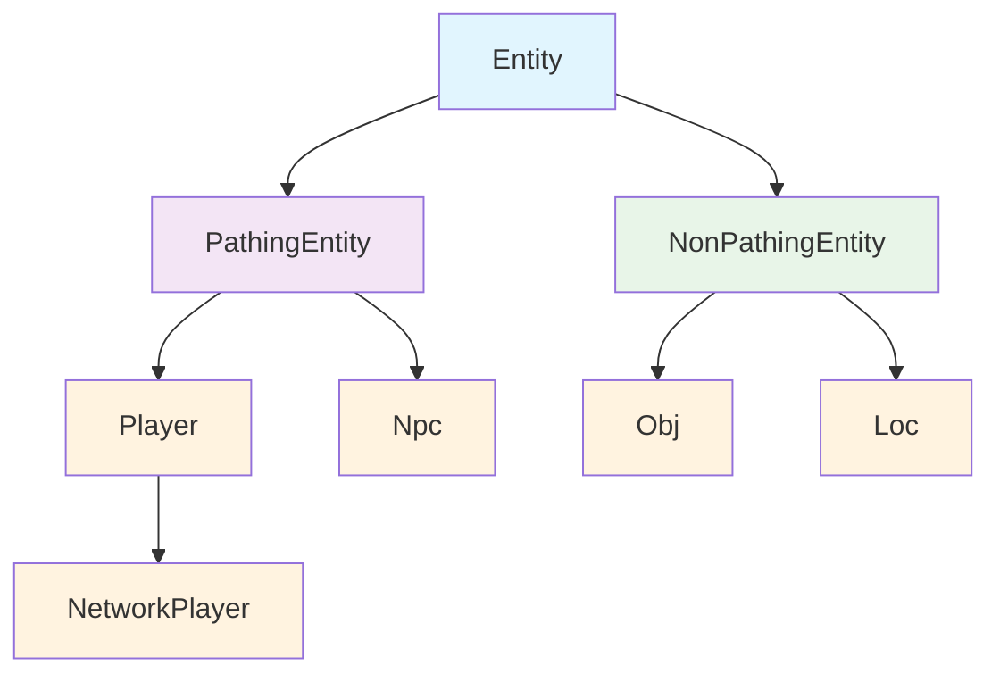
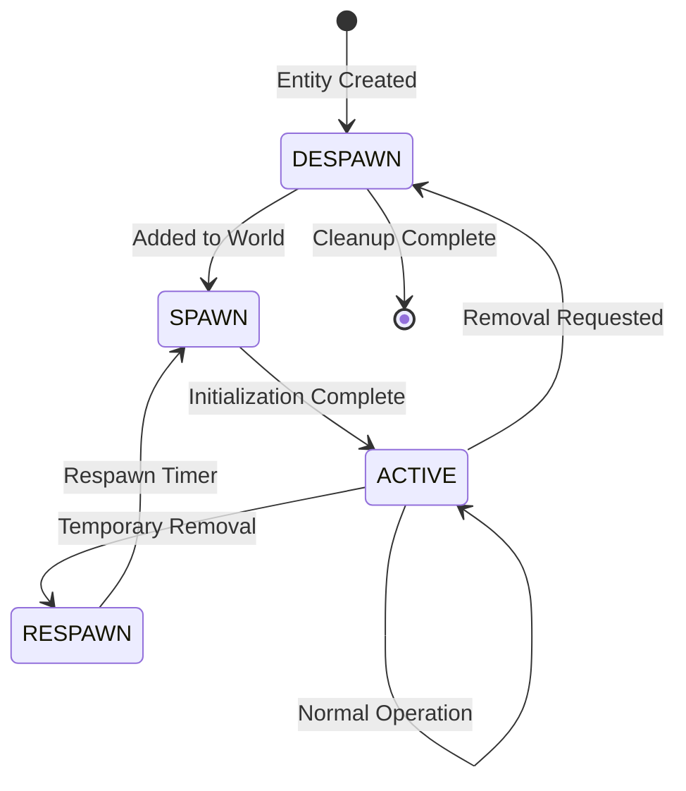

# Entity System Overview

The 04Scapes engine uses a comprehensive entity system to represent all interactive objects in the game world. This system provides a unified interface for managing players, NPCs, objects, and locations while maintaining performance and extensibility.

## Entity Hierarchy

The entity system is built on a class hierarchy that separates concerns based on behavior:



## Base Entity Class

All game entities inherit from the base `Entity` class:

```typescript
// src/engine/entity/Entity.ts
abstract class Entity extends Linkable {
    // Core properties
    level: number = 0;
    x: number = 0;
    z: number = 0;
    
    // Dimensions
    width: number = 1;
    length: number = 1;
    
    // State management
    lifecycle: EntityLifeCycle = EntityLifeCycle.DESPAWN;
    
    // Unique identifier
    uid: number = -1;
    
    // Get absolute coordinate
    get coord(): number {
        return (this.level << 28) | (this.x << 14) | this.z;
    }
    
    // Distance calculation
    distanceTo(other: Entity): number {
        const deltaX = Math.abs(this.x - other.x);
        const deltaZ = Math.abs(this.z - other.z);
        return Math.max(deltaX, deltaZ);
    }
}
```

## Entity Types

<Tabs>
  <Tab title="PathingEntity">
    **PathingEntity** - Entities that can move through the world
    
    ```typescript
    abstract class PathingEntity extends Entity {
        // Movement state
        lastX: number = -1;
        lastZ: number = -1;
        walkDir: number = -1;
        runDir: number = -1;
        
        // Facing direction
        faceX: number = -1;
        faceZ: number = -1;
        orientationX: number = 0;
        orientationZ: number = 0;
        
        // Animation and graphics
        seqId: number = -1;
        seqFrame: number = -1;
        seqCycle: number = 0;
        
        // Movement validation
        validateDistanceWalked(): boolean {
            const distance = this.distanceToLast();
            return distance <= 2; // Max 2 tiles per tick
        }
        
        // Pathfinding
        findPath(destX: number, destZ: number): number[] {
            return World.gameMap.findPath(
                this.level, this.x, this.z,
                destX, destZ, this.width, this.length
            );
        }
    }
    ```
    
    **Key Features:**
    - Position tracking and movement validation
    - Pathfinding integration
    - Animation state management
    - Collision detection
  </Tab>
  
  <Tab title="NonPathingEntity">
    **NonPathingEntity** - Static entities with fixed positions
    
    ```typescript
    abstract class NonPathingEntity extends Entity {
        // Static entities have fixed positions
        // but can still have state changes
        
        // Animation for static objects
        animId: number = -1;
        animCycle: number = 0;
        
        // Lifecycle management
        respawnCycle: number = -1;
        
        // Static collision bounds
        getCollisionStrategy(): CollisionStrategy {
            return CollisionStrategy.BLOCK;
        }
    }
    ```
    
    **Key Features:**
    - Fixed position management
    - State-based animations
    - Respawn mechanics
    - Collision boundaries
  </Tab>
</Tabs>

## Entity Lifecycle

Entities progress through a well-defined lifecycle:



### Lifecycle States

<AccordionGroup>
  <Accordion title="DESPAWN">
    **Initial state** - Entity exists but is not active in the world
    
    - Not visible to players
    - Not processed in game ticks
    - Can be safely modified
    
    ```typescript
    entity.lifecycle = EntityLifeCycle.DESPAWN;
    ```
  </Accordion>
  
  <Accordion title="SPAWN">
    **Spawning state** - Entity is being added to the world
    
    - Added to zone tracking
    - Collision detection enabled
    - Visible to nearby players
    
    ```typescript
    entity.lifecycle = EntityLifeCycle.SPAWN;
    World.addEntity(entity);
    ```
  </Accordion>
  
  <Accordion title="ACTIVE">
    **Active state** - Entity fully operational
    
    - Processes game ticks
    - Responds to interactions
    - Updates position and state
    
    ```typescript
    if (entity.lifecycle === EntityLifeCycle.ACTIVE) {
        entity.processMovement();
        entity.updateAnimations();
    }
    ```
  </Accordion>
  
  <Accordion title="RESPAWN">
    **Respawning state** - Temporary removal with scheduled return
    
    - Removed from world but tracked
    - Respawn timer active
    - Will return to SPAWN state
    
    ```typescript
    entity.lifecycle = EntityLifeCycle.RESPAWN;
    entity.respawnCycle = World.currentTick + 100;
    ```
  </Accordion>
</AccordionGroup>

## Entity Management

### Entity Lists

The world maintains efficient collections for each entity type:

```typescript
// src/engine/entity/EntityList.ts
class EntityList<T extends Entity> {
    private readonly entities: (T | null)[] = [];
    private readonly available: number[] = [];
    
    // Add entity at specific index
    set(index: number, entity: T): void {
        this.entities[index] = entity;
        entity.uid = index;
    }
    
    // Remove entity and mark slot available
    remove(index: number): T | null {
        const entity = this.entities[index];
        if (entity) {
            this.entities[index] = null;
            this.available.push(index);
            entity.uid = -1;
        }
        return entity;
    }
    
    // Find next available slot
    nextAvailableIndex(): number {
        if (this.available.length > 0) {
            return this.available.pop()!;
        }
        return this.entities.length;
    }
}

// World entity collections
class World {
    static readonly players = new PlayerList(2000);
    static readonly npcs = new NpcList(8192);
    // Objects and locations managed per-zone
}
```

### Zone-Based Management

Objects and locations are managed within zones for performance:

```typescript
class Zone {
    // Entity collections per zone
    players: Set<Player> = new Set();
    npcs: Set<Npc> = new Set();
    objs: Set<Obj> = new Set();
    locs: Set<Loc> = new Set();
    
    // Add entity to zone
    enter(entity: Entity): void {
        if (entity instanceof Player) {
            this.players.add(entity);
        } else if (entity instanceof Npc) {
            this.npcs.add(entity);
        }
        // ... handle other types
    }
    
    // Remove entity from zone
    leave(entity: Entity): void {
        if (entity instanceof Player) {
            this.players.delete(entity);
        }
        // ... handle other types
    }
}
```

## Entity Updates and Synchronization

### Update Tracking

The engine tracks which entities need updates sent to clients:

```typescript
class Player {
    // Update flags
    private updates = {
        appearance: false,
        animation: false,
        faceDirection: false,
        graphics: false,
        chat: false
    };
    
    // Mark for update
    setAppearanceUpdate(): void {
        this.updates.appearance = true;
        this.flagUpdate();
    }
    
    // Check if updates needed
    hasUpdates(): boolean {
        return Object.values(this.updates).some(Boolean);
    }
    
    // Clear updates after sending
    clearUpdates(): void {
        this.updates = {
            appearance: false,
            animation: false,
            faceDirection: false,
            graphics: false,
            chat: false
        };
    }
}
```

### Network Synchronization

Players receive updates about entities in their area:

```typescript
// Player info updates (sent each tick)
class PlayerInfoEncoder {
    encode(player: Player, buildArea: BuildArea): Packet {
        const packet = new Packet();
        
        // Encode visible players
        for (const otherPlayer of buildArea.players) {
            if (otherPlayer.hasUpdates()) {
                this.encodePlayerUpdate(packet, otherPlayer);
            }
        }
        
        return packet;
    }
}
```

## Entity Interactions

### Interaction System

Entities can interact with each other through a structured system:

```typescript
class Interaction {
    readonly source: Entity;
    readonly target: Entity;
    readonly type: InteractionType;
    readonly option: number;
    
    // Validate interaction
    isValid(): boolean {
        // Check distance
        if (this.source.distanceTo(this.target) > this.getMaxDistance()) {
            return false;
        }
        
        // Check line of sight
        if (!World.gameMap.hasLineOfSight(
            this.source.x, this.source.z,
            this.target.x, this.target.z, this.source.level
        )) {
            return false;
        }
        
        return true;
    }
    
    // Execute interaction
    execute(): void {
        if (!this.isValid()) {
            return;
        }
        
        // Trigger appropriate script
        const script = this.getInteractionScript();
        if (script) {
            ScriptRunner.init(script, this.source, this.target);
        }
    }
}
```

### Interaction Types

<CardGroup cols={2}>
  <Card title="Player-NPC" icon="handshake">
    Players interacting with NPCs for dialogue, trading, or combat
  </Card>
  <Card title="Player-Object" icon="hand-pointer">
    Players interacting with ground items or equipment
  </Card>
  <Card title="Player-Location" icon="door-open">
    Players interacting with doors, furniture, or other world objects
  </Card>
  <Card title="Player-Player" icon="users">
    Players interacting with each other for trading or combat
  </Card>
</CardGroup>

## Performance Considerations

### Memory Management

The entity system is optimized for performance:

```typescript
// Object pooling for frequently created entities
class EntityPool<T extends Entity> {
    private readonly pool: T[] = [];
    private readonly factory: () => T;
    
    constructor(factory: () => T, initialSize: number = 100) {
        this.factory = factory;
        for (let i = 0; i < initialSize; i++) {
            this.pool.push(factory());
        }
    }
    
    acquire(): T {
        return this.pool.pop() || this.factory();
    }
    
    release(entity: T): void {
        entity.reset(); // Clear state
        this.pool.push(entity);
    }
}
```

### Processing Optimization

- **Zone-based processing**: Only process entities in active zones
- **Update batching**: Batch entity updates for network efficiency
- **Lazy loading**: Load entity data only when needed
- **Collision caching**: Cache collision detection results

## Entity Events

The system supports event-driven interactions:

```typescript
enum EntityEventType {
    SPAWN = 'spawn',
    DESPAWN = 'despawn',
    MOVE = 'move',
    INTERACT = 'interact',
    ATTACK = 'attack',
    DEATH = 'death'
}

class EntityEventSystem {
    private listeners = new Map<EntityEventType, ((event: EntityEvent) => void)[]>();
    
    on(type: EntityEventType, callback: (event: EntityEvent) => void): void {
        if (!this.listeners.has(type)) {
            this.listeners.set(type, []);
        }
        this.listeners.get(type)!.push(callback);
    }
    
    emit(event: EntityEvent): void {
        const callbacks = this.listeners.get(event.type) || [];
        callbacks.forEach(callback => callback(event));
    }
}
```

## Best Practices

<AccordionGroup>
  <Accordion title="Entity Creation">
    - Always use proper lifecycle management
    - Initialize all required properties
    - Add to appropriate collections
    - Handle cleanup properly
    
    ```typescript
    // Good: Proper entity creation
    const npc = new Npc(npcType.id);
    npc.setCoords(x, z, level);
    npc.setLifecycle(EntityLifeCycle.SPAWN);
    World.addNpc(npc);
    ```
  </Accordion>
  
  <Accordion title="State Management">
    - Use atomic operations for state changes
    - Validate state transitions
    - Handle concurrent modifications
    - Log state changes for debugging
  </Accordion>
  
  <Accordion title="Performance">
    - Batch entity operations when possible
    - Use zone-based processing
    - Implement proper cleanup
    - Monitor entity counts and memory usage
  </Accordion>
</AccordionGroup>

## Next Steps

<CardGroup cols={2}>
  <Card title="Player Entity" href="/engine/entities/player" icon="user">
    Learn about player implementation and features
  </Card>
  <Card title="NPC Entity" href="/engine/entities/npc" icon="robot">
    Understand NPC behavior and AI systems
  </Card>
  <Card title="Objects & Items" href="/engine/entities/objects" icon="cube">
    Explore object and item management
  </Card>
  <Card title="Locations" href="/engine/entities/locations" icon="map-marker-alt">
    Learn about world object management
  </Card>
</CardGroup>