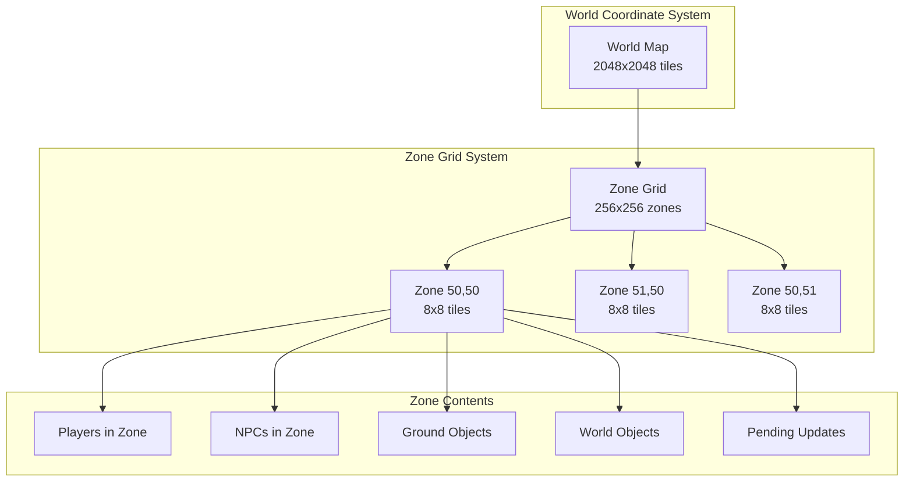

# Zone System

The 04Scapes engine uses a zone-based spatial partitioning system to efficiently manage the game world. Zones divide the world into 8x8 tile regions, allowing the engine to optimize processing, networking, and memory usage by only handling active areas where players are present.

## Zone Architecture



## Zone Structure

Each zone represents an 8x8 tile area and manages all entities within that region:

```typescript
// src/engine/zone/Zone.ts
class Zone {
    // Zone coordinates (world coordinates / 8)
    readonly x: number;
    readonly z: number;
    readonly level: number;
    
    // Entity collections
    readonly players: Set<Player> = new Set();
    readonly npcs: Set<Npc> = new Set();
    readonly objs: Set<Obj> = new Set();
    readonly locs: Set<Loc> = new Set();
    
    // Zone state
    shared: boolean = false; // Multiple players present
    updates: ZoneEvent[] = []; // Pending client updates
    
    // Last tick when zone was active
    lastActive: number = 0;
    
    constructor(x: number, z: number, level: number) {
        this.x = x;
        this.z = z;
        this.level = level;
    }
    
    // Get absolute world coordinates for zone origin
    get worldX(): number {
        return this.x * 8;
    }
    
    get worldZ(): number {
        return this.z * 8;
    }
    
    // Check if zone is currently active (has players)
    get isActive(): boolean {
        return this.players.size > 0;
    }
    
    // Get zone key for map storage
    get key(): string {
        return `${this.level}_${this.x}_${this.z}`;
    }
}
```

## Zone Management

The `ZoneMap` class manages all zones in the world:

<Tabs>
  <Tab title="Zone Creation and Access">
    ```typescript
    // src/engine/zone/ZoneMap.ts
    class ZoneMap {
        private zones: Map<string, Zone> = new Map();
        private activeZones: Set<Zone> = new Set();
        
        // Get or create zone at coordinates
        getZone(x: number, z: number, level: number): Zone {
            // Convert world coordinates to zone coordinates
            const zoneX = Math.floor(x / 8);
            const zoneZ = Math.floor(z / 8);
            const key = `${level}_${zoneX}_${zoneZ}`;
            
            let zone = this.zones.get(key);
            if (!zone) {
                zone = new Zone(zoneX, zoneZ, level);
                this.zones.set(key, zone);
            }
            
            return zone;
        }
        
        // Get zone by zone coordinates (already divided by 8)
        getZoneByCoords(zoneX: number, zoneZ: number, level: number): Zone {
            const key = `${level}_${zoneX}_${zoneZ}`;
            let zone = this.zones.get(key);
            
            if (!zone) {
                zone = new Zone(zoneX, zoneZ, level);
                this.zones.set(key, zone);
            }
            
            return zone;
        }
        
        // Get all zones within a radius
        getZonesInRadius(centerX: number, centerZ: number, level: number, radius: number): Zone[] {
            const zones: Zone[] = [];
            const centerZoneX = Math.floor(centerX / 8);
            const centerZoneZ = Math.floor(centerZ / 8);
            
            for (let x = centerZoneX - radius; x <= centerZoneX + radius; x++) {
                for (let z = centerZoneZ - radius; z <= centerZoneZ + radius; z++) {
                    zones.push(this.getZoneByCoords(x, z, level));
                }
            }
            
            return zones;
        }
        
        // Get all active zones
        getActiveZones(): Zone[] {
            return Array.from(this.activeZones);
        }
        
        // Update zone activity status
        updateZoneActivity(): void {
            this.activeZones.clear();
            
            for (const zone of this.zones.values()) {
                if (zone.isActive) {
                    this.activeZones.add(zone);
                    zone.lastActive = World.currentTick;
                }
            }
        }
    }
    ```
  </Tab>
  
  <Tab title="Entity Zone Management">
    ```typescript
    class Zone {
        // Add entity to zone
        enter(entity: Entity): void {
            if (entity instanceof Player) {
                this.players.add(entity);
                this.updateSharedStatus();
            } else if (entity instanceof Npc) {
                this.npcs.add(entity);
            } else if (entity instanceof Obj) {
                this.objs.add(entity);
            } else if (entity instanceof Loc) {
                this.locs.add(entity);
            }
            
            // Mark zone as active
            if (this.players.size > 0) {
                World.zoneMap.addActiveZone(this);
            }
        }
        
        // Remove entity from zone
        leave(entity: Entity): void {
            if (entity instanceof Player) {
                this.players.delete(entity);
                this.updateSharedStatus();
            } else if (entity instanceof Npc) {
                this.npcs.delete(entity);
            } else if (entity instanceof Obj) {
                this.objs.delete(entity);
            } else if (entity instanceof Loc) {
                this.locs.delete(entity);
            }
            
            // Remove from active zones if empty
            if (this.players.size === 0) {
                World.zoneMap.removeActiveZone(this);
            }
        }
        
        // Update shared status (affects NPC processing)
        private updateSharedStatus(): void {
            this.shared = this.players.size > 1;
        }
        
        // Get all entities in zone
        getAllEntities(): Entity[] {
            return [
                ...Array.from(this.players),
                ...Array.from(this.npcs),
                ...Array.from(this.objs),
                ...Array.from(this.locs)
            ];
        }
        
        // Find entities by type and criteria
        findEntities<T extends Entity>(
            type: new (...args: any[]) => T,
            predicate?: (entity: T) => boolean
        ): T[] {
            let entities: T[] = [];
            
            if (type === Player) {
                entities = Array.from(this.players) as T[];
            } else if (type === Npc) {
                entities = Array.from(this.npcs) as T[];
            } else if (type === Obj) {
                entities = Array.from(this.objs) as T[];
            } else if (type === Loc) {
                entities = Array.from(this.locs) as T[];
            }
            
            return predicate ? entities.filter(predicate) : entities;
        }
    }
    ```
  </Tab>
</Tabs>

## Zone Updates and Events

Zones track changes that need to be sent to clients:

<Tabs>
  <Tab title="Zone Event System">
    ```typescript
    // src/engine/zone/ZoneEvent.ts
    enum ZoneEventType {
        OBJ_ADD = 0,
        OBJ_DEL = 1,
        OBJ_COUNT = 2,
        OBJ_REVEAL = 3,
        LOC_ADD_CHANGE = 4,
        LOC_DEL = 5,
        LOC_ANIM = 6,
        MAP_PROJANIM = 7,
        MAP_ANIM = 8
    }
    
    interface ZoneEvent {
        readonly type: ZoneEventType;
        readonly x: number; // Relative to zone (0-7)
        readonly z: number; // Relative to zone (0-7)
        encode(): Packet;
    }
    
    // Object added to zone
    class ObjAddEvent implements ZoneEvent {
        readonly type = ZoneEventType.OBJ_ADD;
        readonly x: number;
        readonly z: number;
        readonly objType: number;
        readonly count: number;
        
        constructor(x: number, z: number, objType: number, count: number) {
            this.x = x & 0x7; // Mask to zone coordinates
            this.z = z & 0x7;
            this.objType = objType;
            this.count = count;
        }
        
        encode(): Packet {
            const packet = new Packet();
            packet.p1(ZoneEventType.OBJ_ADD);
            packet.p1((this.x << 4) | this.z);
            packet.p2(this.objType);
            packet.p2(this.count);
            return packet;
        }
    }
    
    // Location changed
    class LocAddChangeEvent implements ZoneEvent {
        readonly type = ZoneEventType.LOC_ADD_CHANGE;
        readonly x: number;
        readonly z: number;
        readonly locType: number;
        readonly shape: number;
        readonly angle: number;
        
        constructor(x: number, z: number, locType: number, shape: number, angle: number) {
            this.x = x & 0x7;
            this.z = z & 0x7;
            this.locType = locType;
            this.shape = shape;
            this.angle = angle;
        }
        
        encode(): Packet {
            const packet = new Packet();
            packet.p1(ZoneEventType.LOC_ADD_CHANGE);
            packet.p1((this.x << 4) | this.z);
            packet.p1((this.shape << 2) | this.angle);
            packet.p2(this.locType);
            return packet;
        }
    }
    ```
  </Tab>
  
  <Tab title="Zone Update Processing">
    ```typescript
    class Zone {
        // Add zone update event
        addEvent(event: ZoneEvent): void {
            this.updates.push(event);
        }
        
        // Convenience methods for common events
        writeObjAdd(x: number, z: number, type: number, count: number): void {
            this.addEvent(new ObjAddEvent(x, z, type, count));
        }
        
        writeObjDel(x: number, z: number, type: number): void {
            this.addEvent(new ObjDelEvent(x, z, type));
        }
        
        writeLocChange(x: number, z: number, type: number, shape: number, angle: number): void {
            this.addEvent(new LocAddChangeEvent(x, z, type, shape, angle));
        }
        
        writeLocDel(x: number, z: number, shape: number, angle: number): void {
            this.addEvent(new LocDelEvent(x, z, shape, angle));
        }
        
        writeMapAnim(x: number, z: number, spotAnim: number, height: number, delay: number): void {
            this.addEvent(new MapAnimEvent(x, z, spotAnim, height, delay));
        }
        
        // Process and send all pending updates
        flushUpdates(): void {
            if (this.updates.length === 0) return;
            
            // Create zone update packet
            const packet = new Packet();
            packet.p1(ZoneUpdateProtocol.OPCODE);
            packet.p1(this.x);
            packet.p1(this.z);
            packet.p1(this.level);
            
            // Encode all events
            for (const event of this.updates) {
                const eventPacket = event.encode();
                packet.pdata(eventPacket.data, eventPacket.pos);
            }
            
            // Send to all players in zone
            for (const player of this.players) {
                player.write(new UpdateZonePartialFollows(packet));
            }
            
            // Clear updates
            this.updates.length = 0;
        }
        
        // Clear all pending updates without sending
        clearUpdates(): void {
            this.updates.length = 0;
        }
    }
    ```
  </Tab>
</Tabs>

## Player Build Areas

Each player has a "build area" that determines which zones they can see:

```typescript
// src/engine/entity/BuildArea.ts
class BuildArea {
    private static readonly RADIUS = 6; // 13x13 zones (104x104 tiles)
    
    readonly centerX: number;
    readonly centerZ: number;
    readonly level: number;
    
    readonly zones: Zone[] = [];
    readonly players: Player[] = [];
    readonly npcs: Npc[] = [];
    
    constructor(player: Player) {
        this.centerX = Math.floor(player.x / 8);
        this.centerZ = Math.floor(player.z / 8);
        this.level = player.level;
        
        this.buildZones();
        this.gatherEntities();
    }
    
    private buildZones(): void {
        const startX = this.centerX - BuildArea.RADIUS;
        const endX = this.centerX + BuildArea.RADIUS;
        const startZ = this.centerZ - BuildArea.RADIUS;
        const endZ = this.centerZ + BuildArea.RADIUS;
        
        for (let x = startX; x <= endX; x++) {
            for (let z = startZ; z <= endZ; z++) {
                const zone = World.zoneMap.getZoneByCoords(x, z, this.level);
                this.zones.push(zone);
            }
        }
    }
    
    private gatherEntities(): void {
        for (const zone of this.zones) {
            // Gather players
            for (const player of zone.players) {
                if (this.isInRange(player)) {
                    this.players.push(player);
                }
            }
            
            // Gather NPCs
            for (const npc of zone.npcs) {
                if (this.isInRange(npc)) {
                    this.npcs.push(npc);
                }
            }
        }
    }
    
    private isInRange(entity: PathingEntity): boolean {
        const deltaX = Math.abs(entity.x - this.centerX * 8);
        const deltaZ = Math.abs(entity.z - this.centerZ * 8);
        const maxDistance = (BuildArea.RADIUS + 1) * 8;
        
        return deltaX <= maxDistance && deltaZ <= maxDistance;
    }
    
    // Check if build area has changed significantly
    hasChangedFrom(other: BuildArea): boolean {
        return Math.abs(this.centerX - other.centerX) > 1 ||
               Math.abs(this.centerZ - other.centerZ) > 1 ||
               this.level !== other.level;
    }
}
```

## Zone-Based Processing Optimization

The zone system enables several key optimizations:

<AccordionGroup>
  <Accordion title="Active Zone Processing">
    ```typescript
    class World {
        // Only process zones with players
        static processActiveZones(): void {
            for (const zone of this.zoneMap.getActiveZones()) {
                this.processZone(zone);
            }
        }
        
        private static processZone(zone: Zone): void {
            // Process NPCs in zone
            for (const npc of zone.npcs) {
                if (npc.lifecycle === EntityLifeCycle.ACTIVE) {
                    npc.processAI();
                    npc.processMovement();
                }
            }
            
            // Process ground objects (despawn timers)
            for (const obj of zone.objs) {
                if (obj.despawnCycle !== -1 && this.currentTick >= obj.despawnCycle) {
                    zone.leave(obj);
                    zone.writeObjDel(obj.x & 0x7, obj.z & 0x7, obj.type);
                }
            }
            
            // Process location respawns
            for (const loc of zone.locs) {
                if (loc.respawnCycle !== -1 && this.currentTick >= loc.respawnCycle) {
                    loc.respawnCycle = -1;
                    zone.writeLocChange(
                        loc.x & 0x7, loc.z & 0x7,
                        loc.originalType, loc.shape, loc.angle
                    );
                }
            }
            
            // Send zone updates to players
            zone.flushUpdates();
        }
    }
    ```
  </Accordion>
  
  <Accordion title="Entity Lookup Optimization">
    ```typescript
    class ZoneLookup {
        // Find players near a location (efficient zone-based search)
        static findPlayersNear(x: number, z: number, level: number, radius: number): Player[] {
            const players: Player[] = [];
            const zoneRadius = Math.ceil(radius / 8) + 1;
            
            const zones = World.zoneMap.getZonesInRadius(x, z, level, zoneRadius);
            
            for (const zone of zones) {
                for (const player of zone.players) {
                    const distance = Math.max(
                        Math.abs(player.x - x),
                        Math.abs(player.z - z)
                    );
                    
                    if (distance <= radius) {
                        players.push(player);
                    }
                }
            }
            
            return players;
        }
        
        // Find NPCs by type in area
        static findNpcsByType(x: number, z: number, level: number, type: number, radius: number): Npc[] {
            const npcs: Npc[] = [];
            const zoneRadius = Math.ceil(radius / 8) + 1;
            
            const zones = World.zoneMap.getZonesInRadius(x, z, level, zoneRadius);
            
            for (const zone of zones) {
                for (const npc of zone.npcs) {
                    if (npc.type === type) {
                        const distance = Math.max(
                            Math.abs(npc.x - x),
                            Math.abs(npc.z - z)
                        );
                        
                        if (distance <= radius) {
                            npcs.push(npc);
                        }
                    }
                }
            }
            
            return npcs;
        }
        
        // Check if location is blocked by objects
        static isLocationBlocked(x: number, z: number, level: number): boolean {
            const zone = World.zoneMap.getZone(x, z, level);
            
            // Check for blocking locations
            for (const loc of zone.locs) {
                if (loc.x === x && loc.z === z && loc.level === level) {
                    const locConfig = LocType.get(loc.type);
                    if (locConfig?.blockwalk) {
                        return true;
                    }
                }
            }
            
            return false;
        }
    }
    ```
  </Accordion>
  
  <Accordion title="Memory Management">
    ```typescript
    class ZoneMemoryManager {
        private static readonly CLEANUP_INTERVAL = 1000; // 10 minutes
        private static readonly INACTIVE_THRESHOLD = 5000; // 50 minutes
        
        static cleanup(): void {
            if (World.currentTick % this.CLEANUP_INTERVAL !== 0) {
                return;
            }
            
            let cleaned = 0;
            
            for (const [key, zone] of World.zoneMap.zones) {
                // Skip active zones
                if (zone.isActive) {
                    continue;
                }
                
                // Check if zone has been inactive for too long
                const inactiveTime = World.currentTick - zone.lastActive;
                if (inactiveTime > this.INACTIVE_THRESHOLD) {
                    // Clean up zone if it has no permanent content
                    if (this.canCleanZone(zone)) {
                        World.zoneMap.zones.delete(key);
                        cleaned++;
                    }
                }
            }
            
            if (cleaned > 0) {
                printDebug(`Cleaned up ${cleaned} inactive zones`);
            }
        }
        
        private static canCleanZone(zone: Zone): boolean {
            // Don't clean zones with permanent locations
            if (zone.locs.size > 0) {
                return false;
            }
            
            // Don't clean zones with NPCs (they might respawn)
            if (zone.npcs.size > 0) {
                return false;
            }
            
            // Don't clean zones with player-dropped items
            for (const obj of zone.objs) {
                if (obj.receiverId !== -1) { // Player-specific item
                    return false;
                }
            }
            
            return true;
        }
    }
    ```
  </Accordion>
</AccordionGroup>

## Zone Debugging and Monitoring

Development tools for zone system debugging:

<Tabs>
  <Tab title="Zone Inspector">
    ```typescript
    class ZoneInspector {
        static inspectZone(x: number, z: number, level: number): void {
            const zone = World.zoneMap.getZone(x, z, level);
            
            console.log(`=== Zone ${zone.x}, ${zone.z}, Level ${zone.level} ===`);
            console.log(`World coordinates: ${zone.worldX}-${zone.worldX + 7}, ${zone.worldZ}-${zone.worldZ + 7}`);
            console.log(`Active: ${zone.isActive}`);
            console.log(`Shared: ${zone.shared}`);
            console.log(`Last active: ${zone.lastActive}`);
            
            console.log(`\nPlayers (${zone.players.size}):`);
            for (const player of zone.players) {
                console.log(`  ${player.username} at (${player.x}, ${player.z})`);
            }
            
            console.log(`\nNPCs (${zone.npcs.size}):`);
            for (const npc of zone.npcs) {
                const npcType = NpcType.get(npc.type);
                console.log(`  ${npcType?.name || 'Unknown'} (${npc.type}) at (${npc.x}, ${npc.z})`);
            }
            
            console.log(`\nObjects (${zone.objs.size}):`);
            for (const obj of zone.objs) {
                const objType = ObjType.get(obj.type);
                console.log(`  ${objType?.name || 'Unknown'} (${obj.type}) x${obj.count} at (${obj.x}, ${obj.z})`);
            }
            
            console.log(`\nLocations (${zone.locs.size}):`);
            for (const loc of zone.locs) {
                const locType = LocType.get(loc.type);
                console.log(`  ${locType?.name || 'Unknown'} (${loc.type}) at (${loc.x}, ${loc.z})`);
            }
            
            console.log(`\nPending updates: ${zone.updates.length}`);
        }
        
        static listActiveZones(): void {
            const activeZones = World.zoneMap.getActiveZones();
            
            console.log(`=== Active Zones (${activeZones.length}) ===`);
            
            for (const zone of activeZones) {
                console.log(`Zone ${zone.x}, ${zone.z} (Level ${zone.level}): ${zone.players.size} players`);
            }
        }
        
        static getZoneStatistics(): ZoneStatistics {
            const stats = {
                totalZones: World.zoneMap.zones.size,
                activeZones: 0,
                totalPlayers: 0,
                totalNpcs: 0,
                totalObjs: 0,
                totalLocs: 0,
                pendingUpdates: 0
            };
            
            for (const zone of World.zoneMap.zones.values()) {
                if (zone.isActive) {
                    stats.activeZones++;
                }
                
                stats.totalPlayers += zone.players.size;
                stats.totalNpcs += zone.npcs.size;
                stats.totalObjs += zone.objs.size;
                stats.totalLocs += zone.locs.size;
                stats.pendingUpdates += zone.updates.length;
            }
            
            return stats;
        }
    }
    
    interface ZoneStatistics {
        totalZones: number;
        activeZones: number;
        totalPlayers: number;
        totalNpcs: number;
        totalObjs: number;
        totalLocs: number;
        pendingUpdates: number;
    }
    ```
  </Tab>
  
  <Tab title="Performance Monitoring">
    ```typescript
    class ZonePerformanceMonitor {
        private static zoneProcessingTimes = new Map<string, number[]>();
        private static readonly SAMPLE_SIZE = 100;
        
        static startZoneProcessing(zone: Zone): number {
            return Date.now();
        }
        
        static endZoneProcessing(zone: Zone, startTime: number): void {
            const processingTime = Date.now() - startTime;
            const key = zone.key;
            
            let samples = this.zoneProcessingTimes.get(key);
            if (!samples) {
                samples = [];
                this.zoneProcessingTimes.set(key, samples);
            }
            
            samples.push(processingTime);
            
            // Keep only recent samples
            if (samples.length > this.SAMPLE_SIZE) {
                samples.shift();
            }
            
            // Alert on slow processing
            if (processingTime > 50) { // 50ms threshold
                printWarning(`Slow zone processing: ${key} took ${processingTime}ms`);
            }
        }
        
        static getZonePerformanceReport(): PerformanceReport {
            const report: PerformanceReport = {
                zones: [],
                totalAverage: 0,
                slowestZone: null,
                slowestTime: 0
            };
            
            let totalTime = 0;
            let totalSamples = 0;
            
            for (const [key, samples] of this.zoneProcessingTimes) {
                if (samples.length === 0) continue;
                
                const average = samples.reduce((a, b) => a + b) / samples.length;
                const max = Math.max(...samples);
                
                report.zones.push({
                    zone: key,
                    averageMs: average,
                    maxMs: max,
                    samples: samples.length
                });
                
                totalTime += average * samples.length;
                totalSamples += samples.length;
                
                if (max > report.slowestTime) {
                    report.slowestTime = max;
                    report.slowestZone = key;
                }
            }
            
            report.totalAverage = totalSamples > 0 ? totalTime / totalSamples : 0;
            
            // Sort by average time descending
            report.zones.sort((a, b) => b.averageMs - a.averageMs);
            
            return report;
        }
    }
    
    interface PerformanceReport {
        zones: {
            zone: string;
            averageMs: number;
            maxMs: number;
            samples: number;
        }[];
        totalAverage: number;
        slowestZone: string | null;
        slowestTime: number;
    }
    ```
  </Tab>
</Tabs>

## Best Practices

<AccordionGroup>
  <Accordion title="Zone Boundary Handling">
    When entities move between zones, proper cleanup is essential:
    
    ```typescript
    class Entity {
        moveToZone(newX: number, newZ: number, newLevel: number): void {
            const oldZone = World.zoneMap.getZone(this.x, this.z, this.level);
            const newZone = World.zoneMap.getZone(newX, newZ, newLevel);
            
            // Only change zones if actually moving to different zone
            if (oldZone !== newZone) {
                oldZone.leave(this);
                newZone.enter(this);
            }
            
            // Update coordinates
            this.x = newX;
            this.z = newZ;
            this.level = newLevel;
        }
    }
    ```
  </Accordion>
  
  <Accordion title="Efficient Entity Queries">
    Always use zone-based searches instead of global searches:
    
    ```typescript
    // Good: Zone-based search
    function findNearbyPlayers(x: number, z: number, level: number, radius: number): Player[] {
        return ZoneLookup.findPlayersNear(x, z, level, radius);
    }
    
    // Bad: Global search
    function findNearbyPlayersBad(x: number, z: number, level: number, radius: number): Player[] {
        const nearbyPlayers: Player[] = [];
        
        // This searches ALL players in the world!
        for (const player of World.players) {
            if (!player) continue;
            
            const distance = Math.max(Math.abs(player.x - x), Math.abs(player.z - z));
            if (distance <= radius && player.level === level) {
                nearbyPlayers.push(player);
            }
        }
        
        return nearbyPlayers;
    }
    ```
  </Accordion>
  
  <Accordion title="Zone Update Batching">
    Batch zone updates for efficiency:
    
    ```typescript
    // Batch multiple updates
    function dropMultipleItems(zone: Zone, items: {x: number, z: number, type: number, count: number}[]): void {
        // Add all events first
        for (const item of items) {
            zone.writeObjAdd(item.x, item.z, item.type, item.count);
        }
        
        // Send all updates at once
        zone.flushUpdates();
    }
    ```
  </Accordion>
</AccordionGroup>

## Next Steps

<CardGroup cols={2}>
  <Card title="Game Map" href="/engine/world/game-map" icon="map">
    Learn about collision detection and pathfinding
  </Card>
  <Card title="Collision System" href="/engine/world/collision" icon="shield">
    Understand movement and blocking mechanics
  </Card>
  <Card title="Pathfinding" href="/engine/world/pathfinding" icon="route">
    Explore AI pathfinding algorithms
  </Card>
  <Card title="World Events" href="/engine/world/events" icon="bolt">
    Handle world-wide events and broadcasts
  </Card>
</CardGroup>