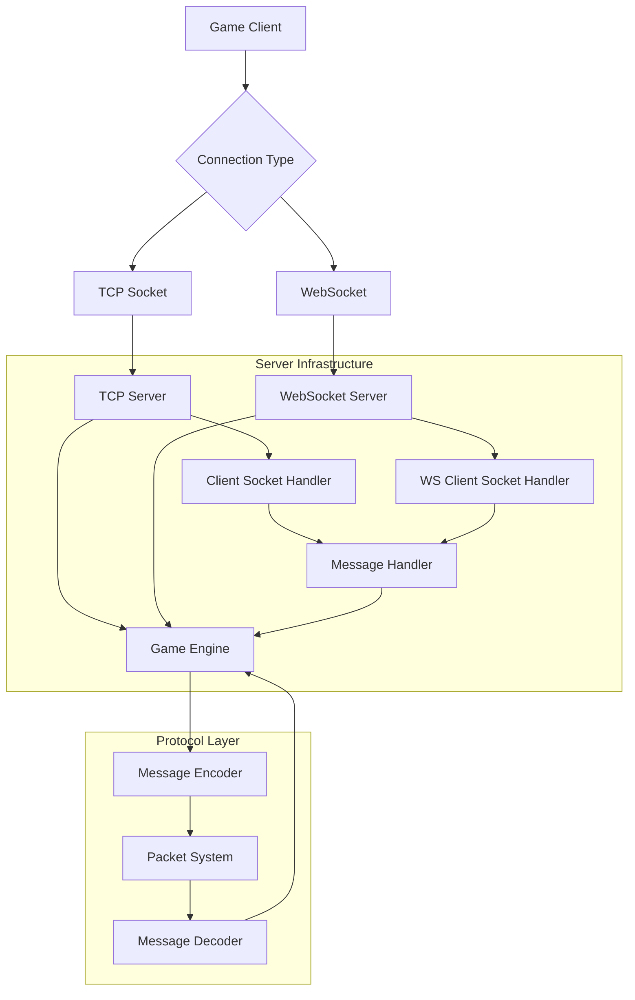

# Networking Overview

The 04Scapes engine implements a robust networking system that handles communication between game clients and the server. The system supports both TCP and WebSocket connections, implements the RuneScape 2 protocol (build 244), and provides efficient message handling for thousands of concurrent players.

## Network Architecture



## Connection Types

The engine supports multiple connection types to accommodate different client implementations:

<Tabs>
  <Tab title="TCP Connections">
    **Primary connection type for native clients**
    
    ```typescript
    // src/server/tcp/TcpServer.ts
    class TcpServer {
        private server: Server;
        
        start(): void {
            this.server = createServer((socket) => {
                const client = new TcpClientSocket(socket);
                this.handleNewConnection(client);
            });
            
            this.server.listen(Environment.GAME_PORT, () => {
                printInfo(`TCP server listening on port ${Environment.GAME_PORT}`);
            });
        }
        
        private handleNewConnection(client: TcpClientSocket): void {
            // Set up client handlers
            client.onMessage = (data) => this.processMessage(client, data);
            client.onClose = () => this.handleDisconnect(client);
            client.onError = (error) => this.handleError(client, error);
            
            // Add to active connections
            World.addClient(client);
        }
    }
    ```
    
    **Features:**
    - Low latency for real-time gameplay
    - Reliable message delivery
    - Efficient for high-frequency updates
    - Native client protocol support
  </Tab>
  
  <Tab title="WebSocket Connections">
    **Browser-based client support**
    
    ```typescript
    // src/server/ws/WSClientSocket.ts
    class WSClientSocket extends ClientSocket {
        private ws: WebSocket;
        
        constructor(ws: WebSocket) {
            super();
            this.ws = ws;
            
            ws.on('message', (data) => {
                this.handleMessage(data);
            });
            
            ws.on('close', () => {
                this.handleClose();
            });
        }
        
        write(packet: Packet): void {
            if (this.ws.readyState === WebSocket.OPEN) {
                this.ws.send(packet.data);
            }
        }
        
        close(): void {
            this.ws.close();
        }
    }
    ```
    
    **Features:**
    - Browser compatibility
    - Cross-platform support
    - Built-in web client integration
    - Same protocol as TCP connections
  </Tab>
  
  <Tab title="Worker Connections">
    **Multi-threaded client handling**
    
    ```typescript
    // src/server/worker/WorkerClientSocket.ts
    class WorkerClientSocket extends ClientSocket {
        private worker: Worker;
        private port: MessagePort;
        
        constructor(worker: Worker, port: MessagePort) {
            super();
            this.worker = worker;
            this.port = port;
            
            port.on('message', (message) => {
                this.handleWorkerMessage(message);
            });
        }
        
        write(packet: Packet): void {
            this.port.postMessage({
                type: 'packet',
                data: packet.data
            });
        }
    }
    ```
    
    **Features:**
    - Scalable multi-threading
    - Load distribution
    - Isolated client processing
    - High concurrency support
  </Tab>
</Tabs>

## Protocol Implementation

The engine implements the RuneScape 2 protocol (build 244) with authentic message formats:

### Message Structure

All network messages follow a consistent structure:

```typescript
// Basic message format
interface NetworkMessage {
    opcode: number;        // Message type identifier
    length: number;        // Message length (if variable)
    payload: Uint8Array;   // Message data
}

// Example client message
class MoveClick implements ClientMessage {
    static readonly OPCODE = 164;
    
    x: number;
    z: number;
    ctrlHeld: boolean;
    
    static decode(packet: Packet): MoveClick {
        const message = new MoveClick();
        message.x = packet.g2();      // Read 2 bytes (x coordinate)
        message.z = packet.g2();      // Read 2 bytes (z coordinate)  
        message.ctrlHeld = packet.g1() === 1; // Read 1 byte (ctrl flag)
        return message;
    }
}
```

### Protocol Versioning

The engine supports protocol versioning for client compatibility:

```typescript
// src/network/game/client/codec/rs244/ClientProt244.ts
class ClientProt244 {
    // Movement
    static readonly MOVE_CLICK = 164;
    static readonly MOVE_MINIMAP = 18;
    
    // Object interactions
    static readonly OP_LOC1 = 132;
    static readonly OP_LOC2 = 252;
    static readonly OP_LOC3 = 70;
    static readonly OP_LOC4 = 234;
    static readonly OP_LOC5 = 228;
    
    // NPC interactions
    static readonly OP_NPC1 = 155;
    static readonly OP_NPC2 = 17;
    static readonly OP_NPC3 = 21;
    static readonly OP_NPC4 = 18;
    static readonly OP_NPC5 = 233;
    
    // Player interactions
    static readonly OP_PLAYER1 = 128;
    static readonly OP_PLAYER2 = 37;
    static readonly OP_PLAYER3 = 227;
    
    // Interface interactions
    static readonly IF_BUTTON = 185;
    static readonly IF_PLAYER_DESIGN = 99;
    
    // Chat and messaging
    static readonly MESSAGE_PUBLIC = 86;
    static readonly MESSAGE_PRIVATE = 126;
    static readonly CHAT_SET_MODE = 95;
    
    // Inventory actions
    static readonly INV_BUTTON1 = 145;
    static readonly INV_BUTTON2 = 117;
    static readonly INV_BUTTON3 = 43;
    static readonly INV_BUTTON4 = 129;
    static readonly INV_BUTTON5 = 135;
}
```

## Message Processing Pipeline

Messages flow through a structured processing pipeline:

<Steps>
  <Step title="Reception">
    Raw bytes received from client connection
    
    ```typescript
    // ClientSocket receives raw data
    onMessage(data: Buffer): void {
        this.inBuffer.writeBytes(data);
        this.processIncomingMessages();
    }
    ```
  </Step>
  
  <Step title="Decoding">
    Raw bytes decoded into message objects
    
    ```typescript
    // Message decoder processes packets
    class MessageDecoder {
        decode(opcode: number, packet: Packet): ClientMessage | null {
            const decoder = this.getDecoder(opcode);
            if (!decoder) {
                return null;
            }
            return decoder.decode(packet);
        }
    }
    ```
  </Step>
  
  <Step title="Validation">
    Messages validated for security and correctness
    
    ```typescript
    // Validate message before processing
    if (!this.validateMessage(message, player)) {
        this.handleInvalidMessage(player, message);
        return;
    }
    ```
  </Step>
  
  <Step title="Handling">
    Messages processed by appropriate handlers
    
    ```typescript
    // Route message to handler
    const handler = this.getHandler(message.constructor);
    handler.handle(player, message);
    ```
  </Step>
  
  <Step title="Response">
    Server generates and sends response messages
    
    ```typescript
    // Send response to client
    player.write(new UpdatePlayerInfo(buildArea));
    ```
  </Step>
</Steps>

## Client Message Types

The protocol defines numerous message types for different interactions:

<AccordionGroup>
  <Accordion title="Movement Messages">
    ```typescript
    // Walking/running movement
    class MoveClick {
        static readonly OPCODE = 164;
        x: number;
        z: number;
        ctrlHeld: boolean; // Running flag
    }
    
    // Minimap teleport
    class MoveMinimapClick {
        static readonly OPCODE = 18;
        x: number;
        z: number;
    }
    
    // Handler implementation
    class MoveClickHandler implements MessageHandler<MoveClick> {
        handle(player: Player, message: MoveClick): void {
            if (!player.canMove()) {
                return;
            }
            
            // Validate movement distance
            const distance = player.distanceTo(message.x, message.z);
            if (distance > 25) { // Max click distance
                return;
            }
            
            // Find path to destination
            const path = player.findPath(message.x, message.z);
            if (path.length > 0) {
                player.clearWaypoints();
                player.setWaypoints(path, message.ctrlHeld);
            }
        }
    }
    ```
  </Accordion>
  
  <Accordion title="Interaction Messages">
    ```typescript
    // Object interaction
    class OpLoc {
        static readonly OPCODE = 132; // First click option
        x: number;
        z: number;
        loc: number; // Object ID
        mode: number; // Interaction mode
    }
    
    // NPC interaction
    class OpNpc {
        static readonly OPCODE = 155; // First click option
        npc: number; // NPC index
        mode: number;
    }
    
    // Player interaction
    class OpPlayer {
        static readonly OPCODE = 128; // First click option
        player: number; // Player index
    }
    ```
  </Accordion>
  
  <Accordion title="Interface Messages">
    ```typescript
    // Interface button click
    class IfButton {
        static readonly OPCODE = 185;
        component: number; // Interface component ID
        option: number;    // Button option (1-10)
    }
    
    // Inventory item use
    class InvButton {
        static readonly OPCODE = 145; // First click
        component: number;
        slot: number;
        item: number;
    }
    
    // Item on item
    class InvButtonD {
        static readonly OPCODE = 53;
        fromComponent: number;
        fromSlot: number;
        toComponent: number;
        toSlot: number;
    }
    ```
  </Accordion>
  
  <Accordion title="Chat Messages">
    ```typescript
    // Public chat
    class MessagePublic {
        static readonly OPCODE = 86;
        color: number;
        effect: number;
        message: string;
    }
    
    // Private message
    class MessagePrivate {
        static readonly OPCODE = 126;
        username: string;
        message: string;
    }
    
    // Chat mode changes
    class ChatSetMode {
        static readonly OPCODE = 95;
        publicMode: number;
        privateMode: number;
        tradeMode: number;
    }
    ```
  </Accordion>
</AccordionGroup>

## Server Message Types

The server sends various message types to update client state:

<Tabs>
  <Tab title="Player Updates">
    ```typescript
    // Player information update
    class PlayerInfo implements ServerMessage {
        static readonly OPCODE = 134;
        static readonly PRIORITY = ServerProtPriority.HIGH;
        
        buildArea: BuildArea;
        
        encode(): Packet {
            const packet = new Packet();
            packet.p1(PlayerInfo.OPCODE);
            
            // Encode player list updates
            this.encodePlayerUpdates(packet);
            
            return packet;
        }
        
        private encodePlayerUpdates(packet: Packet): void {
            // Complex player update encoding
            for (const player of this.buildArea.players) {
                if (player.hasUpdates()) {
                    this.encodePlayerUpdate(packet, player);
                }
            }
        }
    }
    ```
  </Tab>
  
  <Tab title="Interface Updates">
    ```typescript
    // Set interface text
    class IfSetText implements ServerMessage {
        static readonly OPCODE = 126;
        
        component: number;
        text: string;
        
        encode(): Packet {
            const packet = new Packet();
            packet.p1(IfSetText.OPCODE);
            packet.p2(this.component);
            packet.pjstr(this.text);
            return packet;
        }
    }
    
    // Open interface
    class IfOpenMain implements ServerMessage {
        static readonly OPCODE = 97;
        
        component: number;
        
        encode(): Packet {
            const packet = new Packet();
            packet.p1(IfOpenMain.OPCODE);
            packet.p2(this.component);
            return packet;
        }
    }
    ```
  </Tab>
  
  <Tab title="Zone Updates">
    ```typescript
    // Object added to zone
    class ObjAdd implements ZoneMessage {
        static readonly OPCODE = 151;
        
        x: number;
        z: number;
        type: number;
        count: number;
        
        encode(): Packet {
            const packet = new Packet();
            packet.p1(ObjAdd.OPCODE);
            packet.p1(this.x);
            packet.p1(this.z);
            packet.p2(this.type);
            packet.p2(this.count);
            return packet;
        }
    }
    
    // Location change
    class LocAddChange implements ZoneMessage {
        static readonly OPCODE = 151;
        
        x: number;
        z: number;
        type: number;
        shape: number;
        angle: number;
        
        encode(): Packet {
            const packet = new Packet();
            packet.p1(LocAddChange.OPCODE);
            packet.p1((this.x << 4) | this.z);
            packet.p1((this.shape << 2) | this.angle);
            packet.p2(this.type);
            return packet;
        }
    }
    ```
  </Tab>
</Tabs>

## Packet System

The engine uses a sophisticated packet system for message serialization:

```typescript
// src/io/Packet.ts
class Packet {
    data: Uint8Array;
    pos: number = 0;
    bitPos: number = 0;
    
    constructor(data?: Uint8Array) {
        this.data = data || new Uint8Array(5000);
    }
    
    // Write methods
    p1(value: number): void {
        this.data[this.pos++] = value & 0xff;
    }
    
    p2(value: number): void {
        this.data[this.pos++] = (value >> 8) & 0xff;
        this.data[this.pos++] = value & 0xff;
    }
    
    p4(value: number): void {
        this.data[this.pos++] = (value >> 24) & 0xff;
        this.data[this.pos++] = (value >> 16) & 0xff;
        this.data[this.pos++] = (value >> 8) & 0xff;
        this.data[this.pos++] = value & 0xff;
    }
    
    pjstr(value: string): void {
        const bytes = new TextEncoder().encode(value);
        for (const byte of bytes) {
            this.p1(byte);
        }
        this.p1(10); // Newline terminator
    }
    
    // Read methods
    g1(): number {
        return this.data[this.pos++] & 0xff;
    }
    
    g2(): number {
        return ((this.data[this.pos++] & 0xff) << 8) | 
               (this.data[this.pos++] & 0xff);
    }
    
    g4(): number {
        return ((this.data[this.pos++] & 0xff) << 24) |
               ((this.data[this.pos++] & 0xff) << 16) |
               ((this.data[this.pos++] & 0xff) << 8) |
               (this.data[this.pos++] & 0xff);
    }
    
    gjstr(): string {
        const start = this.pos;
        while (this.data[this.pos] !== 10 && this.pos < this.data.length) {
            this.pos++;
        }
        const bytes = this.data.slice(start, this.pos);
        this.pos++; // Skip terminator
        return new TextDecoder().decode(bytes);
    }
    
    // Bit manipulation
    accessBits(): void {
        this.bitPos = this.pos * 8;
    }
    
    accessBytes(): void {
        this.pos = Math.ceil(this.bitPos / 8);
    }
    
    gBit(numBits: number): number {
        let bytePos = this.bitPos >> 3;
        let bitOffset = 8 - (this.bitPos & 7);
        let value = 0;
        this.bitPos += numBits;
        
        for (; numBits > bitOffset; bitOffset = 8) {
            value += (this.data[bytePos++] & BITMASK[bitOffset]) << (numBits - bitOffset);
            numBits -= bitOffset;
        }
        
        if (numBits === bitOffset) {
            value += this.data[bytePos] & BITMASK[bitOffset];
        } else {
            value += (this.data[bytePos] >> (bitOffset - numBits)) & BITMASK[numBits];
        }
        
        return value;
    }
}
```

## Connection Security

The networking system implements several security measures:

<AccordionGroup>
  <Accordion title="RSA Encryption">
    ```typescript
    // RSA key exchange for login
    class LoginRequest {
        encryptedBlock: Uint8Array; // RSA encrypted login data
        
        decrypt(): LoginData {
            const privateKey = forge.pki.privateKeyFromPem(Environment.RSA_PRIVATE_KEY);
            const decrypted = privateKey.decrypt(this.encryptedBlock, 'RSAES-PKCS1-V1_5');
            
            const packet = new Packet(decrypted);
            return {
                username: packet.gjstr(),
                password: packet.gjstr(),
                sessionId: packet.g4(),
                clientSeed: packet.g8()
            };
        }
    }
    ```
  </Accordion>
  
  <Accordion title="ISAAC Cipher">
    ```typescript
    // Stream cipher for packet encryption
    class Isaac {
        private rsl: number[] = new Array(256);
        private mem: number[] = new Array(256);
        private count: number = 0;
        private a: number = 0;
        private b: number = 0;
        private c: number = 0;
        
        constructor(seed: number[]) {
            this.init(seed);
        }
        
        next(): number {
            if (this.count-- === 0) {
                this.isaac();
                this.count = 255;
            }
            return this.rsl[this.count];
        }
        
        private isaac(): void {
            // ISAAC algorithm implementation
            this.c++;
            this.b += this.c;
            
            for (let i = 0; i < 256; i++) {
                const x = this.mem[i];
                
                switch (i % 4) {
                    case 0: this.a ^= this.a << 13; break;
                    case 1: this.a ^= this.a >>> 6; break;
                    case 2: this.a ^= this.a << 2; break;
                    case 3: this.a ^= this.a >>> 16; break;
                }
                
                this.a += this.mem[(i + 128) % 256];
                const y = this.mem[(x >>> 2) % 256] + this.a + this.b;
                this.mem[i] = y;
                this.b = this.mem[(y >>> 10) % 256] + x;
                this.rsl[i] = this.b;
            }
        }
    }
    ```
  </Accordion>
  
  <Accordion title="Rate Limiting">
    ```typescript
    // Connection rate limiting
    class RateLimiter {
        private connections = new Map<string, number[]>();
        private readonly maxConnections = 3;
        private readonly timeWindow = 60000; // 1 minute
        
        checkLimit(ip: string): boolean {
            const now = Date.now();
            const timestamps = this.connections.get(ip) || [];
            
            // Remove old timestamps
            const recent = timestamps.filter(time => now - time < this.timeWindow);
            
            if (recent.length >= this.maxConnections) {
                return false; // Rate limited
            }
            
            recent.push(now);
            this.connections.set(ip, recent);
            return true;
        }
    }
    ```
  </Accordion>
</AccordionGroup>

## Performance Optimization

The networking system includes several performance optimizations:

<Tabs>
  <Tab title="Message Batching">
    ```typescript
    class Player {
        private outPackets: Packet[] = [];
        private batchTimer: number = 0;
        
        write(message: ServerMessage): void {
            const packet = message.encode();
            this.outPackets.push(packet);
            
            // Batch messages for efficiency
            if (this.batchTimer === 0) {
                this.batchTimer = 1; // Send next tick
            }
        }
        
        flush(): void {
            if (this.outPackets.length === 0) return;
            
            // Combine all packets into single buffer
            const totalSize = this.outPackets.reduce((size, packet) => 
                size + packet.pos, 0);
                
            const combined = new Uint8Array(totalSize);
            let offset = 0;
            
            for (const packet of this.outPackets) {
                combined.set(packet.data.subarray(0, packet.pos), offset);
                offset += packet.pos;
            }
            
            // Send combined buffer
            this.client?.write(combined);
            this.outPackets.length = 0;
            this.batchTimer = 0;
        }
    }
    ```
  </Tab>
  
  <Tab title="Zone-Based Updates">
    ```typescript
    class Zone {
        private updates: ZoneMessage[] = [];
        private observingPlayers: Set<Player> = new Set();
        
        addUpdate(message: ZoneMessage): void {
            this.updates.push(message);
        }
        
        flushUpdates(): void {
            if (this.updates.length === 0) return;
            
            // Batch zone updates for all observing players
            const packet = new Packet();
            packet.p1(ZONE_UPDATE_OPCODE);
            packet.p1(this.x);
            packet.p1(this.z);
            packet.p1(this.level);
            packet.p1(this.updates.length);
            
            for (const update of this.updates) {
                const updatePacket = update.encode();
                packet.pdata(updatePacket.data, updatePacket.pos);
            }
            
            // Send to all observing players
            for (const player of this.observingPlayers) {
                player.write(new ZoneUpdate(packet));
            }
            
            this.updates.length = 0;
        }
    }
    ```
  </Tab>
  
  <Tab title="Connection Pooling">
    ```typescript
    class ConnectionPool {
        private availableConnections: ClientSocket[] = [];
        private activeConnections = new Set<ClientSocket>();
        private readonly maxConnections = 2000;
        
        acquire(): ClientSocket | null {
            if (this.activeConnections.size >= this.maxConnections) {
                return null; // Server full
            }
            
            let connection = this.availableConnections.pop();
            if (!connection) {
                connection = new ClientSocket();
            }
            
            this.activeConnections.add(connection);
            return connection;
        }
        
        release(connection: ClientSocket): void {
            this.activeConnections.delete(connection);
            
            // Reset connection state
            connection.reset();
            
            // Return to pool for reuse
            this.availableConnections.push(connection);
        }
    }
    ```
  </Tab>
</Tabs>

## Error Handling and Logging

Comprehensive error handling and logging for network operations:

```typescript
class NetworkLogger {
    static logConnection(client: ClientSocket, event: string): void {
        const ip = client.remoteAddress || 'unknown';
        printInfo(`[${ip}] ${event}`);
    }
    
    static logError(client: ClientSocket, error: Error): void {
        const ip = client.remoteAddress || 'unknown';
        printError(`[${ip}] Network error: ${error.message}`);
        
        // Log to file for analysis
        this.writeErrorLog(ip, error);
    }
    
    static logInvalidMessage(client: ClientSocket, opcode: number): void {
        const ip = client.remoteAddress || 'unknown';
        printWarning(`[${ip}] Invalid message opcode: ${opcode}`);
        
        // Track for potential abuse
        this.trackSuspiciousActivity(ip, 'invalid_message');
    }
    
    private static trackSuspiciousActivity(ip: string, type: string): void {
        // Implementation for tracking and potential banning
        const key = `${ip}:${type}`;
        const count = (suspiciousActivity.get(key) || 0) + 1;
        suspiciousActivity.set(key, count);
        
        if (count > 10) { // Threshold for action
            printWarning(`Suspicious activity from ${ip}: ${type} (${count} times)`);
            // Consider temporary IP ban
        }
    }
}
```

## Next Steps

<CardGroup cols={2}>
  <Card title="Client Protocol" href="/networking/client-protocol" icon="arrow-right">
    Learn about client-to-server message formats
  </Card>
  <Card title="Server Protocol" href="/networking/server-protocol" icon="arrow-left">
    Understand server-to-client messages
  </Card>
  <Card title="Packet Structure" href="/networking/packet-structure" icon="box">
    Deep dive into packet encoding/decoding
  </Card>
  <Card title="Message Handling" href="/networking/message-handling" icon="cog">
    Explore message processing pipeline
  </Card>
</CardGroup>