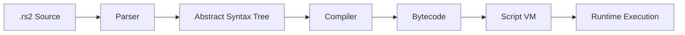

# RuneScript Overview

RuneScript is a domain-specific programming language designed specifically for creating game content in the 04Scapes engine. It provides a high-level interface for implementing quests, NPCs, objects, interfaces, and other interactive elements while maintaining the authentic feel of the original game.

## What is RuneScript?

RuneScript is a compiled scripting language that:

- **Compiles to Bytecode**: Scripts are compiled to efficient bytecode for fast execution
- **Type Safe**: Strong typing prevents many common scripting errors  
- **Game-Specific**: Built-in operations for common game tasks
- **Event-Driven**: Responds to player actions and game events
- **Authentic**: Recreates the original game's scripting capabilities

```runescript
// Example RuneScript code
[clientscript,tutorial_guide]
if_setontimer(null, -1, tutorial_guide);
if_openmainmodal(tutorial_guide);

[proc,tutorial_say](string $message)
~chatplayer(happy, $message);
~chatnpc(hans, happy, "Welcome to the world of " + server_name + "!");
```

## Script Types

RuneScript supports several types of scripts for different purposes:

<Tabs>
  <Tab title="Client Scripts">
    **[clientscript,name]** - Scripts that run on the client side
    
    ```runescript
    [clientscript,bank_withdraw]
    // Handle bank withdrawal interface
    if_setonclick("bank_withdraw_1", 1, bank_withdraw_interface);
    if_setonclick("bank_withdraw_5", 5, bank_withdraw_interface);
    if_setonclick("bank_withdraw_10", 10, bank_withdraw_interface);
    if_setonclick("bank_withdraw_all", -1, bank_withdraw_interface);
    ```
    
    **Use Cases:**
    - Interface interactions
    - Client-side validation
    - Visual effects and animations
    - Input handling
  </Tab>
  
  <Tab title="Procedures">
    **[proc,name]** - Reusable server-side procedures
    
    ```runescript
    [proc,give_reward](int $item, int $count)
    if (inv_freespace(inv) < 1) {
        mes("You don't have enough inventory space.");
        return;
    }
    inv_add(inv, $item, $count);
    mes("You receive " + $count + " x " + oc_name($item) + ".");
    ```
    
    **Use Cases:**
    - Common gameplay functions
    - Utility procedures
    - Shared logic between scripts
    - Mathematical calculations
  </Tab>
  
  <Tab title="Object Scripts">
    **[oploc1-5,obj_id]** - Location object interactions
    
    ```runescript
    [oploc1,door_basic]
    // Open/close door
    if (loc_type = door_closed) {
        loc_change(door_open, 2);
        sound_synth(door_open, 0, 0);
    } else {
        loc_change(door_closed, 2);
        sound_synth(door_close, 0, 0);
    }
    ```
    
    **Use Cases:**
    - Door and gate interactions
    - Furniture usage
    - Interactive scenery
    - Skill training objects
  </Tab>
  
  <Tab title="NPC Scripts">
    **[opnpc1-5,npc_id]** - NPC interaction scripts
    
    ```runescript
    [opnpc1,hans]
    // Talk to Hans
    ~chatnpc(hans, happy, "Hello there, adventurer!");
    ~chatplayer(happy, "Hi Hans, how are you?");
    ~chatnpc(hans, happy, "I'm doing well, thank you for asking.");
    
    // Offer services
    switch_int(~multi2("Ask about the town", "Nevermind")) {
        case 1: ~hans_about_town;
        case 2: ~chatplayer(neutral, "See you later.");
    }
    ```
  </Tab>
  
  <Tab title="Item Scripts">
    **[opobj1-5,item_id]** - Ground item interactions
    
    ```runescript
    [opobj1,coins]
    // Pick up coins
    if (inv_freespace(inv) < 1) {
        mes("You don't have enough inventory space.");
        return;
    }
    
    inv_add(inv, obj_type, obj_count);
    obj_del;
    sound_synth(coins, 0, 0);
    ```
  </Tab>
</Tabs>

## Script Compilation and Execution

### Compilation Process

RuneScript goes through several compilation phases:



<Steps>
  <Step title="Parsing">
    Source code is parsed into tokens and validated for syntax errors
  </Step>
  
  <Step title="AST Generation">
    Tokens are organized into an Abstract Syntax Tree representing program structure
  </Step>
  
  <Step title="Type Checking">
    Variables and function calls are validated for type safety
  </Step>
  
  <Step title="Code Generation">
    AST is compiled to bytecode instructions
  </Step>
  
  <Step title="Optimization">
    Bytecode is optimized for performance
  </Step>
</Steps>

### Execution Environment

Scripts execute within a sandboxed virtual machine:

```typescript
// src/engine/script/ScriptRunner.ts
class ScriptState {
    // Execution context
    readonly script: ScriptFile;
    readonly args: ScriptArgument[];
    
    // Entity references
    self: Entity | null = null;
    
    // Active entities for script operations
    _activePlayer: Player | null = null;
    _activeNpc: Npc | null = null;
    _activeLoc: Loc | null = null;
    _activeObj: Obj | null = null;
    
    // Runtime stacks
    intStack: number[] = [];
    stringStack: string[] = [];
    intLocals: number[] = [];
    stringLocals: string[] = [];
    
    // Execution state
    pc: number = 0; // Program counter
    fp: number = 0; // Frame pointer
}
```

## Variable System

RuneScript supports several types of variables:

<Tabs>
  <Tab title="Local Variables">
    Variables scoped to the current script or procedure:
    
    ```runescript
    [proc,example_locals]
    def_int $local_int = 42;
    def_string $local_string = "Hello World";
    def_coord $local_coord = 0_50_50; // level_x_z format
    
    // Use variables
    mes("The number is: " + tostring($local_int));
    mes("The message is: " + $local_string);
    ```
    
    **Types:**
    - `$variable` - Local to current scope
    - Strongly typed (int, string, coord, etc.)
    - Automatic cleanup when scope ends
  </Tab>
  
  <Tab title="Player Variables">
    Variables stored per-player for persistent state:
    
    ```runescript
    [proc,quest_progress]
    // %var_name format for player variables
    if (%tutorial_progress = 0) {
        %tutorial_progress = 1;
        mes("You begin the tutorial.");
    }
    
    // Check quest completion
    if (%tutorial_progress >= 10) {
        mes("You have completed the tutorial!");
    }
    ```
    
    **Features:**
    - Persistent across sessions
    - Unique per player
    - Used for quest progress, settings, etc.
  </Tab>
  
  <Tab title="Global Variables">
    Server-wide variables shared between all players:
    
    ```runescript
    [proc,server_event]
    // Global variables use %% prefix
    if (%%server_event_active = 1) {
        mes("A special event is currently running!");
        
        // Increment global counter
        %%event_participants = calc(%%event_participants + 1);
    }
    ```
    
    **Use Cases:**
    - Server events
    - Global counters
    - World state tracking
  </Tab>
  
  <Tab title="NPC Variables">
    Variables stored per-NPC for AI state:
    
    ```runescript
    [ai_timer,guard_npc]
    // NPC variables use %npc_ prefix
    if (%npc_last_patrol = 0) {
        %npc_last_patrol = map_clock;
        ~npc_walk(coord);
    }
    
    // Check if enough time has passed
    if (calc(map_clock - %npc_last_patrol) > 100) {
        ~npc_return_to_spawn;
    }
    ```
  </Tab>
</Tabs>

## Built-in Operations

RuneScript provides many built-in operations for common game tasks:

<AccordionGroup>
  <Accordion title="Player Operations">
    ```runescript
    // Player information
    mes("Your name is: " + displayname);
    mes("Your combat level is: " + stat(attack));
    mes("Current location: " + coord);
    
    // Player actions
    p_walk(0_50_50); // Walk to coordinate
    p_teleport(lumbridge); // Teleport
    p_delay(5); // Wait 5 ticks
    
    // Stats and skills
    stat_add(attack, 1000); // Add XP
    if (stat_base(attack) >= 60) {
        mes("You can use dragon weapons!");
    }
    ```
  </Accordion>
  
  <Accordion title="Inventory Operations">
    ```runescript
    // Check inventory
    if (inv_total(inv, coins) >= 1000) {
        inv_del(inv, coins, 1000);
        inv_add(inv, rune_sword, 1);
        mes("You purchase a rune sword!");
    } else {
        mes("You need 1000 coins to buy this.");
    }
    
    // Inventory management
    if (inv_freespace(inv) < 1) {
        mes("Your inventory is full.");
        return;
    }
    ```
  </Accordion>
  
  <Accordion title="Object and Location Operations">
    ```runescript
    // Spawn objects
    obj_add(loc_coord, coins, 100, 300); // Add coins for 5 minutes
    
    // Change locations
    loc_change(door_open, 100); // Change to open door for 100 ticks
    
    // Location properties
    if (loc_type = chest_closed) {
        mes("The chest is closed.");
    }
    ```
  </Accordion>
  
  <Accordion title="Interface Operations">
    ```runescript
    // Open interfaces
    if_openmain(bank_interface);
    if_openside(quest_journal);
    
    // Set interface text
    if_settext("Welcome to the bank!", bank_title_component);
    
    // Interface interactions
    if_setonclick("deposit_all", -1, bank_interface);
    ```
  </Accordion>
</AccordionGroup>

## Event System

RuneScript responds to various game events through triggers:

<Tabs>
  <Tab title="Player Events">
    ```runescript
    // Login event
    [login]
    mes("Welcome to " + server_name + "!");
    if (%first_login = 0) {
        %first_login = 1;
        ~tutorial_start;
    }
    
    // Logout event  
    [logout]
    // Save important state
    %last_logout = map_clock;
    
    // Level up event
    [levelup,attack]
    mes("Congratulations! You have reached level " + stat_base(attack) + " Attack!");
    sound_synth(levelup, 0, 0);
    ```
  </Tab>
  
  <Tab title="Combat Events">
    ```runescript
    // Combat start
    [combat_start]
    if (npc_type = dragon) {
        mes("The dragon breathes fire!");
        spotanim_npc(fire_breath, 0);
    }
    
    // Death event
    [death]
    mes("Oh dear, you are dead!");
    p_teleport(lumbridge_respawn);
    
    // NPC death
    [npc_death,goblin]
    // 50% chance to drop coins
    if (random(2) = 1) {
        obj_add(npc_coord, coins, calc(5 + random(10)));
    }
    ```
  </Tab>
  
  <Tab title="Timer Events">
    ```runescript
    // Periodic timer
    [timer,server_announcement]
    if (calc(map_clock % 1000) = 0) {
        mes("Server restart in 10 minutes!");
    }
    
    // Player-specific timer
    [p_timer,poison_damage]
    if (%poison_level > 0) {
        %poison_level = calc(%poison_level - 1);
        p_damage(1);
        mes("You feel the poison coursing through your veins.");
        
        if (%poison_level > 0) {
            p_settimer(poison_damage, 5); // Continue in 5 ticks
        }
    }
    ```
  </Tab>
</Tabs>

## Dialogue System

RuneScript includes a comprehensive dialogue system:

```runescript
[proc,hans_conversation]
~chatnpc(hans, happy, "Hello there! Welcome to Lumbridge!");

switch_int(~multi4("Who are you?", "Where am I?", "What should I do?", "Goodbye")) {
    case 1:
        ~chatplayer(neutral, "Who are you?");
        ~chatnpc(hans, happy, "I'm Hans, I've been living in Lumbridge for many years.");
        ~chatnpc(hans, happy, "I help new adventurers get started on their journey.");
        
    case 2:
        ~chatplayer(neutral, "Where am I?");
        ~chatnpc(hans, happy, "You're in Lumbridge, a peaceful town in the kingdom of Misthalin.");
        ~chatnpc(hans, happy, "It's a great place for new adventurers to begin their journey.");
        
    case 3:
        ~chatplayer(neutral, "What should I do?");
        ~chatnpc(hans, happy, "There's plenty to explore! Try talking to other people around town.");
        ~chatnpc(hans, happy, "You could also try your hand at some skills like woodcutting or fishing.");
        
    case 4:
        ~chatplayer(neutral, "I should be going now. Goodbye!");
        ~chatnpc(hans, happy, "Farewell! Have a safe journey!");
}
```

## Error Handling and Debugging

RuneScript includes debugging features:

```runescript
[proc,debug_example]
// Debug output
debugmes("Debug: Player location is " + coord);

// Assertions
if (stat_base(attack) < 1) {
    error("Invalid attack level detected!");
    return;
}

// Try-catch equivalent
def_int $result = ~safe_calculation(100, 0);
if ($result = -1) {
    mes("Calculation failed - division by zero!");
    return;
}
```

## Performance Considerations

<AccordionGroup>
  <Accordion title="Script Optimization">
    - **Cache Lookups**: Store frequently used values in variables
    - **Minimize Database Calls**: Batch operations when possible
    - **Use Procedures**: Share common logic to reduce code duplication
    - **Avoid Infinite Loops**: Always include exit conditions
    
    ```runescript
    // Good: Cache the value
    def_int $attack_level = stat_base(attack);
    if ($attack_level >= 60 & $attack_level < 70) {
        // Use $attack_level instead of calling stat_base repeatedly
    }
    
    // Bad: Repeated expensive operations
    if (stat_base(attack) >= 60 & stat_base(attack) < 70) {
        // stat_base called twice
    }
    ```
  </Accordion>
  
  <Accordion title="Memory Management">
    - Local variables are automatically cleaned up
    - Player variables persist across sessions
    - Avoid creating too many global variables
    - Clean up unused NPC variables
  </Accordion>
  
  <Accordion title="Execution Limits">
    - Scripts have execution time limits to prevent infinite loops
    - Complex calculations should be spread across multiple ticks
    - Use `p_delay()` for long-running operations
  </Accordion>
</AccordionGroup>

## Best Practices

<Steps>
  <Step title="Use Descriptive Names">
    ```runescript
    // Good
    def_int $coins_required = 1000;
    def_string $item_name = oc_name($item_id);
    
    // Bad
    def_int $x = 1000;
    def_string $s = oc_name($y);
    ```
  </Step>
  
  <Step title="Validate Input">
    ```runescript
    [proc,give_item](int $item, int $count)
    if ($item < 1 | $count < 1) {
        error("Invalid item parameters");
        return;
    }
    
    if (inv_freespace(inv) < 1) {
        mes("Not enough inventory space.");
        return;
    }
    ```
  </Step>
  
  <Step title="Use Procedures for Common Logic">
    ```runescript
    [proc,check_requirements](int $level, int $item)
    if (stat_base(attack) < $level) {
        mes("You need " + tostring($level) + " Attack to use this.");
        return(false);
    }
    
    if (inv_total(inv, $item) < 1) {
        mes("You need a " + oc_name($item) + " to do this.");
        return(false);
    }
    
    return(true);
    ```
  </Step>
  
  <Step title="Handle Edge Cases">
    ```runescript
    [proc,safe_divide](int $a, int $b)
    if ($b = 0) {
        error("Division by zero!");
        return(0);
    }
    return(calc($a / $b));
    ```
  </Step>
</Steps>

## Development Workflow

The typical RuneScript development process:

<Steps>
  <Step title="Write Scripts">
    Create `.rs2` files in the appropriate directories based on script type
  </Step>
  
  <Step title="Compile">
    Scripts are automatically compiled when the server starts or when files change
  </Step>
  
  <Step title="Test">
    Test scripts in-game and check server logs for errors
  </Step>
  
  <Step title="Debug">
    Use debug output and server logs to identify and fix issues
  </Step>
  
  <Step title="Deploy">
    Completed scripts are automatically available to players
  </Step>
</Steps>

## Next Steps

<CardGroup cols={2}>
  <Card title="RuneScript Syntax" href="/scripting/syntax" icon="code">
    Learn the complete RuneScript language syntax
  </Card>
  <Card title="Variables & Types" href="/scripting/variables" icon="database">
    Master the variable system and data types
  </Card>
  <Card title="Script Triggers" href="/scripting/triggers" icon="bolt">
    Understand event triggers and handlers
  </Card>
  <Card title="Core Operations" href="/scripting/opcodes/core" icon="cog">
    Explore built-in script operations
  </Card>
</CardGroup>